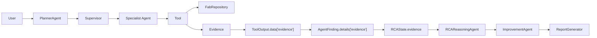
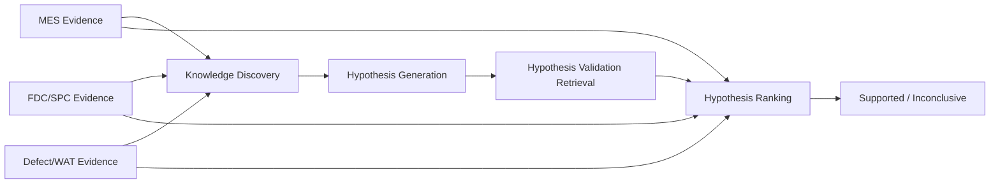

# Yield RCA V1 Upgrade：当前代码 Diff 与演进式迁移方案

> 分析依据：`Semiconductor_Yield_RCA_Agent_V1_Upgrade_Plan.md`  
> 分析对象：当前项目代码  
> 文档日期：2026-07-24  
> 本轮范围：只分析和制定迁移方案，不修改业务代码

## 1. 结论

V1 Upgrade Plan 的方向正确，但当前项目不是从零开始。以下基础能力已经存在：

- `Evidence`、`evidence_ids` 和 `RCAState` 引用完整性校验；
- Tool 是唯一允许访问 Repository 的工程能力边界；
- MES、FDC、Defect/WAT、Knowledge Specialist 已不直接决定最终 Root Cause；
- RCA Reasoning 已有 `supported/inconclusive` Gate、冲突检查和 Top-3 Candidate；
- Knowledge 只检索 `CONFIRMED` Case；
- Improvement、双工程师 Approval、Knowledge Publication 已形成闭环；
- Qwen 不能发明 Evidence ID，最终支持门槛仍由确定性代码控制。

因此不应重写 Planner、Supervisor、Tool、Agent、API 和 React。正确做法是：

```text
保留现有主链
  -> 先把 Evidence 从“通用引用记录”升级为“带明确工业语义的核心模型”
  -> 让 Tool 逐个改用统一 Evidence Builder
  -> 让 Specialist Agent 逐个迁移到 First-class Evidence
  -> 再升级 Knowledge Asset / Retriever
  -> 最后引入两阶段 RAG 和多 Hypothesis Engine
```

第一阶段只实现 Evidence Foundation，不改变任何 RCA 结果和 Agent 调度行为。

---

## 2. 迁移原则

### 2.1 不推倒重写

继续保留：

```text
PurePythonRCAWorkflow
PlannerAgent
Supervisor
FabRepository
Tool Layer
AgentFinding
RCAState
FastAPI Adapter
React Dashboard
PostgreSQL Schema 和现有 Seed
```

### 2.2 先兼容，再收紧

不能第一步就删除：

```text
Evidence.summary
Evidence.source_type
AgentFinding.evidence_ids
ToolOutput.evidence_ids
details["evidence"]
现有 EV_* Evidence ID
```

这些字段被 Report、Frontend、Evaluation、Memory 和大量 Contract Test 使用。迁移初期采用
Additive Schema，所有旧字段继续可读写。

### 2.3 Evidence ID 暂不改名

`ground_truth.json`、Evaluation、Report 和测试都引用现有 ID，例如：

```text
EV_MES_COMMON_CHAMBER
EV_FDC_SLURRY_FLOW
EV_SPC_OOC_CONTEXT
EV_DEFECT_CU_RESIDUE
EV_KNOWLEDGE_MATCH
```

V1 第一轮给它们增加 `evidence_type`，不批量重命名 ID。ID 命名策略可以在完成全链迁移后
单独版本化。

### 2.4 Evidence Confidence 不是 Root Cause Probability

新 `Evidence.confidence` 表示：

> 系统对这条 observation 本身可靠性和完整性的评价。

它不表示：

> 在这条 Evidence 存在时某个 Root Cause 成立的概率。

Root Cause 的支持/反驳关系和最终 Confidence 由 Hypothesis Engine 单独计算。

### 2.5 AgentFinding 保留为执行信封

Upgrade Plan 中“所有 Agent 输出 Evidence”不应机械理解为删除 `AgentFinding`。

推荐目标合同：

```text
AgentFinding
  - Agent 的执行摘要
  - Warnings
  - 执行级 Confidence
  - First-class Evidence[]
  - evidence_ids（兼容字段）
```

Evidence 是事实主体；AgentFinding 是 Supervisor 调度和 UI 展示所需的执行信封。

---

## 3. 当前代码基线

### 3.1 当前调用链



### 3.2 当前 Evidence 模型

位置：`core/yield_rca_core/models.py`

```python
class Evidence:
    evidence_id
    source_type
    source_id
    summary
    source_table
    source_field
    timestamp
    metadata
```

已经具备：

- 唯一 ID；
- 数据来源类型；
- Source Record；
- 表/字段级 Provenance；
- Timestamp；
- Metadata；
- 序列化、反序列化和校验。

缺少：

- `evidence_type`；
- `source_agent`；
- `source_tool`；
- 规范化 `observation`；
- 结构化 Entity；
- Evidence 自身 Confidence；
- Evidence Quality / Missing-data 语义；
- 按类型和 Entity 查询的统一 Evidence Collection。

### 3.3 当前 Tool Evidence

位置：`core/yield_rca_core/tool_layer.py`

Tool 已经创建 `Evidence`，但 `_tool_output()` 将完整 Evidence 放进：

```python
ToolOutput.data["evidence"]
```

`ToolOutput` 自身只有：

```text
evidence_ids
```

这使 Evidence 是 ToolOutput 的隐藏 Payload，而不是 First-class Field。

### 3.4 当前 Specialist Agent

位置：`core/yield_rca_core/specialist_agents.py`

Agent 从 ToolOutput 收集：

```text
evidence_ids
data["evidence"]
warnings
```

然后重新写进：

```text
AgentFinding.evidence_ids
AgentFinding.details["evidence"]
```

这形成两份需要保持一致的表示。

现有 Contract Test 已检查二者集合相等，说明当前架构已经意识到该风险，但还没有消除重复。

### 3.5 当前 Supervisor

位置：`core/yield_rca_core/supervisor.py`

Supervisor 当前通过：

```python
finding.details["evidence"]
```

重建 `Evidence` 并合并到 `RCAState.evidence`。

它已经实现：

- 同 Evidence ID 相同 Payload 去重；
- 同 Evidence ID 不同 Payload 报错；
- Finding 引用未知 Evidence 报错。

但 `_finding_for(state, agent)` 强制：

```text
每个 Agent 在 State 中只能有一个 Finding
```

两阶段 RAG 需要 Knowledge Agent 执行 Discovery 和 Hypothesis Validation 两次，因此后续必须
改为按 `task_id/finding_kind` 查 Finding。

### 3.6 当前 RCA Reasoning

位置：`core/yield_rca_core/rca_reasoning_agent.py`

当前流程：

```text
Specialist Finding
  -> 固定证据权重
  -> 规则生成一个主要 Candidate
  -> 可追溯 Top-3 Candidate
  -> Conflict / Evidence Sufficiency Gate
  -> 一个最终 Hypothesis
```

当前 `Hypothesis` 只有：

```text
root_cause
confidence
evidence_ids
status
rationale
```

缺少：

- 多个正式 Hypothesis；
- Supporting Evidence 和 Contradicting Evidence 分离；
- 每个 Hypothesis 的 Validation Result；
- Stage 2 Knowledge Validation；
- Hypothesis Rank / Reject Reason。

### 3.7 当前 Knowledge / RAG

当前实现：

```text
Specialist 事实
  -> Supervisor 拼接 Query
  -> RetrieveSimilarCaseTool
  -> Confirmed RCA Case metadata + keyword score
  -> 最佳 Case 的 Knowledge Document
```

已有：

- `RCA_CASE`、`SOP`、`ENGINEERING_NOTE` 文档类型；
- `CONFIRMED` Gate；
- Memory Candidate 双审批；
- 发布回 `rca_case` 和 `knowledge_document`。

缺少：

- 通用 `KnowledgeAsset` 合同；
- Literature；
- Module/Equipment/Recipe/Version/Owner 等完整治理字段；
- Retriever Protocol；
- Top-K Retrieval Result；
- Recall@K/MRR；
- Vector/Hybrid/Rerank；
- 针对 Hypothesis 的第二阶段检索。

---

## 4. Upgrade Plan 对照 Diff

| Upgrade 目标 | 当前实现 | 主要 Diff | 判断 |
|---|---|---|---|
| Evidence 是核心结构 | 已有 Evidence 和引用校验 | 增加工业语义、Entity、Agent/Tool Source、Confidence | 演进 |
| Agent 不直接决定 Root Cause | Specialist 已满足 | 收紧输出合同，禁止 Specialist 产生 Hypothesis | 小改 |
| Tool 生成 Evidence | 已满足，但 Evidence 藏在 `data` | ToolOutput 增加 First-class `evidence` | 中改 |
| Agent 统一输出 Evidence | 通过 details 间接输出 | AgentFinding 增加 First-class `evidence` | 中改 |
| Evidence Layer | Supervisor 中有部分合并逻辑 | 抽取 Builder、Collection、Validation | 新增 |
| Knowledge Asset | 两张表分担 Case/Document | 新统一模型和数据库迁移，保留旧表适配 | 中改 |
| Retriever 抽象 | 检索写死在 Tool | 提取 Protocol + KeywordRetriever | 中改 |
| Vector/Hybrid 扩展 | 未实现 | 只预留接口，不在 Evidence 第一阶段实现 | 后续 |
| 两阶段 RAG | 当前只有 Stage 1 | TaskPlan、Supervisor、Finding 索引需升级 | 大改 |
| Hypothesis Engine | 单 Candidate + Score | 多 Hypothesis、Support/Contradict、Rank | 大改 |
| Human Approval | 已实现 | Knowledge Asset 发布与索引更新需接入 | 小到中改 |
| RAG Evaluation | 未实现 | Recall@K、MRR Dataset 和 Runner | 新增 |
| RCA/Agent Evaluation | 已有大部分 | 增加 Hypothesis/Evidence Type 指标 | 扩展 |

---

## 5. Evidence V1 目标模型

### 5.1 推荐模型

第一阶段建议采用以下目标，而不是只增加几个自由字符串：

```python
class EvidenceType(StrEnum):
    LOT_CONTEXT
    PROCESS_EXPOSURE
    EQUIPMENT_EXPOSURE
    IMPACT_SCOPE
    RECIPE_CHANGE
    HOLD_EVENT
    PARAMETER_DEVIATION
    TREND_DEVIATION
    OOC_EVENT
    SPC_VIOLATION
    EXCURSION_WINDOW
    DEFECT_SIGNAL
    METROLOGY_DEVIATION
    ELECTRICAL_FAILURE
    HISTORICAL_CASE_MATCH
    SOP_GUIDANCE
    ENGINEERING_NOTE
    NEGATIVE_SIGNAL
    DATA_MISSING


class EntityType(StrEnum):
    PRODUCT
    LOT
    WAFER
    ROUTE
    OPERATION
    EQUIPMENT
    CHAMBER
    RECIPE
    PARAMETER
    DEFECT
    WAT_ITEM
    EXCURSION
    KNOWLEDGE_ASSET


@dataclass(frozen=True)
class EvidenceEntity:
    entity_type: str
    entity_id: str
    attributes: dict[str, Any]


@dataclass(frozen=True)
class Evidence:
    # 现有兼容字段
    evidence_id: str
    source_type: str
    source_id: str
    summary: str
    source_table: str | None
    source_field: str | None
    timestamp: str | None
    metadata: dict[str, Any]

    # V1 新字段
    evidence_type: str
    source_agent: str
    source_tool: str
    observation: str
    entities: list[EvidenceEntity]
    confidence: float
    evidence_schema_version: str
```

### 5.2 为什么使用 `entities` 而不是单个 `entity`

工业 Evidence 经常同时涉及：

```text
Source Lot + Impact Lots
Equipment + Chamber
Recipe + Parameter
Excursion + Trigger Hold
```

只允许一个 Entity 会迫使代码继续把关键关系塞进 `metadata`。V1 推荐使用至少一个
`EvidenceEntity` 的列表。

### 5.3 Evidence Type 与 Source Type 的区别

```text
source_type = 数据来自 MES/FDC/WAT/Knowledge/Analytics
evidence_type = 这条观察在工程上是什么
```

示例：

```text
source_type   = analytics
evidence_type = SPC_VIOLATION

source_type   = mes
evidence_type = PROCESS_EXPOSURE
```

不能删除 `source_type`，因为它仍然是数据血缘的一部分。

### 5.4 Support / Contradict 不放进 Evidence 本体

一条 Evidence 对 H1 可能是 Supporting，对 H2 可能是 Contradicting。因此关系应放在后续：

```python
class HypothesisEvidenceLink:
    hypothesis_id
    evidence_id
    relation  # support / contradict / neutral
    weight
    rationale
```

Evidence 本身保持客观 Observation。

### 5.5 Evidence Builder

新增统一 Builder，避免每个 Tool 手工填写 Source：

```python
EvidenceBuilder.from_tool(
    tool_input=tool_input,
    evidence_id="EV_FDC_SLURRY_FLOW",
    evidence_type=EvidenceType.PARAMETER_DEVIATION,
    observation="slurry_flow mean decreased from 150 to 132 ml/min",
    entities=[...],
    confidence=0.98,
    source_id="fdc_feature:6400:slurry_flow",
    source_table="fdc_feature",
    source_field="slurry_flow",
    timestamp=...,
    metadata={...},
)
```

Builder 自动取得：

```text
source_agent = tool_input.requested_by
source_tool  = tool_input.tool_name
```

这可以防止 Agent/Tool Source 写错。

### 5.6 Evidence Collection

把 Supervisor 现有 Evidence 合并逻辑抽取为框架无关对象：

```text
add()
merge()
get(evidence_id)
require(evidence_ids)
by_type()
by_entity()
to_list()
```

它只做集合、索引和一致性校验，不在 V1 实现 Evidence Graph。

---

## 6. 分阶段迁移计划

## Phase 0：冻结当前行为基线

### 目标

在任何重构前固定当前输出。

### 工作

- 保留当前 Golden/Multi/SPC Ground Truth；
- 保存 `LOT_A_015`、`LOT_A_038`、`LOT_A_063` RCAState Snapshot；
- 记录 Product Window Case；
- 固定 Root Cause、Status、Impact Scope、Warnings、Report Citation；
- 记录当前完整测试基线。

### Gate

```text
现有 170 passed / 3 skipped 不退化
LOT_A_015 = supported / 0.95 / 4 impact Lots
LOT_A_038 = inconclusive
LOT_A_063 = supported
```

该阶段不改业务代码，只补必要的 Snapshot/Contract。

---

## Phase 1：Evidence Foundation

这是用户要求首先实施的阶段。完成并确认后，才开始迁移 Tool 或 Agent。

### 新增文件

```text
core/yield_rca_core/evidence_models.py
core/yield_rca_core/evidence_builder.py
core/yield_rca_core/evidence_collection.py
tests/unit/test_evidence_models.py
tests/unit/test_evidence_builder.py
tests/contract/test_evidence_layer_contracts.py
```

### 修改文件

```text
core/yield_rca_core/models.py
  - 从 evidence_models re-export Evidence
  - 保持原 import path 可用

core/yield_rca_core/__init__.py
  - 导出 EvidenceType、EntityType、EvidenceEntity、EvidenceBuilder

tests/unit/test_models.py
tests/contract/test_domain_contracts.py
  - 增加 V1 Evidence round-trip 和 legacy compatibility
```

### 兼容策略

Phase 1 中新字段采用 Additive Contract：

- 旧 `Evidence.from_dict()` 仍可读取；
- 旧构造方式仍可运行；
- 新 `EvidenceBuilder` 必须生成完整 V1 Evidence；
- `summary` 保留，V1 中与 `observation` 一致或由 Builder 生成；
- 全局 `SCHEMA_VERSION=1.0` 暂不升级；
- Evidence 使用独立 `evidence_schema_version`。

### Phase 1 不做

```text
不修改任何 Tool 的工程逻辑
不修改 Specialist Agent
不修改 Planner/Supervisor 调度
不修改 RCA Scoring
不修改 API Response 的旧字段
不做数据库 Migration
不做 Vector RAG
```

### 验收

- V1 Evidence 可序列化、反序列化和校验；
- Legacy Evidence 可兼容读取；
- Evidence Confidence、Entity、Type、Agent、Tool Source 合法；
- 同 ID 不同 Payload 会报错；
- Builder 不能生成无 Entity、无 Observation 或未知 Type 的 Evidence；
- 当前所有 RCA Case 结果完全不变。

---

## Phase 2：Tool Layer 迁移

### 目标

Tool 成为 V1 Evidence 的唯一事实生产者。

### 2A：ToolOutput First-class Evidence

修改：

```text
core/yield_rca_core/models.py
core/yield_rca_core/tool_layer.py
tests/contract/test_tool_layer_contracts.py
```

目标合同：

```python
ToolOutput(
    data=...,
    evidence=[Evidence(...)],
    evidence_ids=[...],
)
```

迁移期继续镜像：

```text
data["evidence"]
```

并强制三者集合一致：

```text
ToolOutput.evidence
ToolOutput.evidence_ids
ToolOutput.data["evidence"]
```

### 2B：按 Tool 分批迁移

批次 1，MES：

```text
FindAffectedLotsTool
GetLotContextTool
FindImpactLotsTool
AnalyzeLotGenealogyTool
```

批次 2，Defect/WAT：

```text
SummarizeDefectWatTool
```

批次 3，FDC/SPC：

```text
AnalyzeParameterShiftTool
FindOocEventsTool
PerformBasicSpcAnalysisTool
AnalyzeSpcEvidenceTool
```

批次 4，Knowledge：

```text
RetrieveSimilarCaseTool
```

### 重点处理

- Missing Data 应生成 `DATA_MISSING` Evidence，而不是只有无引用 Warning；
- Normal/No-impact 应生成 `NEGATIVE_SIGNAL` Evidence；
- 逐步移除 Tool 内手工 `Evidence(...)`，统一改用 Builder；
- 现有 Evidence ID 保持不变。

### 验收

- 每个 Tool 返回 First-class V1 Evidence；
- Source Agent/Tool 自动且正确；
- 现有 Tool 数据结果不变；
- 所有 Warning 尽可能有 Evidence；纯配置错误可无 Evidence；
- Golden/Multi/SPC Workflow 结果不变。

---

## Phase 3：Specialist Agent 逐个迁移

### 目标

Agent 只解释 Tool Evidence，不复制或重建事实，也不输出最终 Root Cause。

### 目标 AgentFinding

```python
AgentFinding(
    summary=...,
    confidence=...,
    evidence=[...],
    evidence_ids=[...],
    details=agent_specific_interpretation,
    warnings=[...],
)
```

迁移期 `details["evidence"]` 继续镜像。Agent 完成迁移后，Supervisor 优先使用
`AgentFinding.evidence`。

### 3A：MES Agent

原因：它定义 Source Lot、Impact Scope 和后续所有 Agent 的上下文。

工作：

- Product Window 和 Lot-driven 两条路径使用同一 Evidence Collector；
- Summary 只解释 Process Exposure、Recipe、Hold 和 Scope；
- 不使用 Root Cause 语言；
- `target_commonality` 保留为执行细节，事实依据来自 Typed Evidence。

### 3B：Defect/WAT Agent

原因：逻辑较独立，适合验证 Agent Migration 模式。

工作：

- Defect、Metrology、Electrical Failure 分成独立 Evidence Type；
- Physical/Electrical Consistency 是 Agent Interpretation，不伪装成原始 Observation；
- No-impact 使用 Negative Evidence。

### 3C：FDC Agent

原因：该 Agent 最复杂，包含 Feature、OOC 和两套 SPC。

工作：

- Parameter、Trend、OOC、SPC 分开建 Evidence；
- SPC Rule Window 和 Trigger/Impact Scope 保持可追溯；
- 稳定控制参数作为 Neutral/Normal Observation，不直接稀释异常 Evidence；
- 不在 FDC Agent 中输出设备 Root Cause。

### 3D：Knowledge Agent

先迁移当前 Keyword Retrieval 输出，不同时引入 Vector RAG：

- Historical Case 转换为 `HISTORICAL_CASE_MATCH`；
- SOP 转换为 `SOP_GUIDANCE`；
- Engineering Note 转换为 `ENGINEERING_NOTE`；
- Knowledge Agent 只报告检索结果，不决定 Hypothesis。

### LLM 约束

当前 Specialist Review 已要求 Qwen 保留相同 `evidence_ids`。迁移后进一步要求：

```text
Qwen 不能修改 Evidence Payload
Qwen 不能修改 Evidence Confidence
Qwen 只能生成 Agent Summary 和 Engineering Interpretation
```

### 每个 Agent 的独立 Gate

- 该 Agent Contract Test 全部通过；
- 该 Agent Tool Allowlist 不变；
- Agent 模块仍无 Repository/SQL 依赖；
- 序列化 Round-trip 通过；
- 当前 Case Root Cause 和 Scope 不变；
- 完成一个 Agent 后再迁移下一个。

---

## Phase 4：RCAState、Supervisor 和展示层切换

### 目标

完成 First-class Evidence Cutover，停止依赖隐藏 Payload。

### Supervisor Diff

```text
旧：
finding.details["evidence"]

新：
finding.evidence
```

`EvidenceCollection` 负责合并和引用校验。

### State Diff

`RCAState.evidence` 保持不变，但增加便捷索引：

```text
evidence_by_id
evidence_by_type
evidence_by_entity
```

索引不进入序列化，避免重复数据。

### API / Frontend Diff

保持现有字段并增加：

```text
evidence_type
source_agent
source_tool
observation
entities
confidence
evidence_schema_version
```

更新：

```text
frontend/src/types.ts
frontend/src/components/EvidenceChain.tsx
frontend/src/selectors.ts
```

Evidence UI 增加 Type、Entity、Source Tool 和 Observation，不在 React 中推理。

### 旧字段退场条件

只有全部 Tool、Agent、Report、Frontend、Evaluation 完成迁移后，才能停止写：

```text
ToolOutput.data["evidence"]
AgentFinding.details["evidence"]
```

读取兼容至少保留一个版本。

---

## Phase 5：Knowledge Asset 与 Retriever 抽象

### 5.1 Knowledge Asset

推荐新增：

```text
core/yield_rca_core/knowledge_models.py
db/migrations/005_knowledge_asset.up.sql
db/migrations/005_knowledge_asset.down.sql
```

建议字段：

```text
asset_id
asset_type: RCA_CASE / SOP / ENGINEERING_NOTE / LITERATURE
title
content
module
equipment_id/equipment_type
recipe_id/recipe_version
source
version
approval_status
created_by
approved_by
created_at
approved_at
metadata
```

### 5.2 不立即删除旧表

保留：

```text
rca_case
knowledge_document
```

先通过 Adapter 将现有数据映射为 `KnowledgeAsset`，新写入采用双写或事务内兼容发布。完成
Backfill 和 Retrieval Cutover 后再决定是否保留旧表为结构化 Case 扩展。

### 5.3 Retriever Protocol

新增：

```python
class Retriever(Protocol):
    def retrieve(
        self,
        query: RetrievalQuery,
        *,
        top_k: int,
    ) -> list[RetrievalCandidate]:
        ...
```

Phase 5 只实现：

```text
KeywordRetriever
```

它承接现有 `RetrieveSimilarCaseTool` 的评分逻辑。`VectorRetriever` 和
`HybridRetriever` 只在接口层预留，不创建返回假数据的空实现。

### 5.4 Tool 兼容

`RetrieveSimilarCaseTool` 暂时保留名称，内部改为调用 Retriever。后续新增通用
`RetrieveKnowledgeTool`，完成调用方迁移后再弃用旧名称。

---

## Phase 6：两阶段 RAG

### 6.1 目标 DAG



### 6.2 Supervisor 前置改造

当前 `_finding_for(state, agent)` 假设每个 Agent 只有一个 Finding。需要改为：

```text
finding_for_task(task_id)
findings_for_agent(agent)
finding_for_kind(agent, finding_kind)
```

`AgentFinding` 增加：

```text
task_id
finding_kind
```

建议 Finding Kind：

```text
SPECIALIST_OBSERVATION
KNOWLEDGE_DISCOVERY
KNOWLEDGE_VALIDATION
HYPOTHESIS_GENERATION
HYPOTHESIS_RANKING
IMPROVEMENT
```

### 6.3 Stage 1

输入 Typed Evidence，输出 Top-K Candidate Knowledge：

```text
Evidence-driven Query
Metadata Filter
Keyword Retriever
Candidate Knowledge Evidence
```

### 6.4 Stage 2

对 Top-N Hypothesis 分别检索：

```text
supporting knowledge
contradicting knowledge
known failure mechanism
known exclusion condition
```

输出 `HypothesisValidationResult`，不直接覆盖 Hypothesis。

### 6.5 Planner

Planner 仍只创建 TaskPlan。它可以引用同一 Knowledge Agent 两次，但必须使用不同 Task ID 和
Finding Kind。

---

## Phase 7：Hypothesis Engine

### 7.1 新模型

在兼容当前 `Hypothesis.evidence_ids` 的前提下增加：

```python
class Hypothesis:
    hypothesis_id
    root_cause
    supporting_evidence_ids
    contradicting_evidence_ids
    neutral_evidence_ids
    validation_results
    confidence
    rank
    status
    rationale
    rejection_reasons
```

兼容字段：

```text
evidence_ids = supporting + contradicting + neutral 的去重集合
```

### 7.2 Engine 分层

```text
HypothesisGenerator
  -> HypothesisValidator
  -> HypothesisRanker
  -> DecisionGate
```

推荐先用确定性规则生成 Candidate，再允许 Qwen 在 Candidate Catalog 内补充工程表达。不要在
第一版让 Qwen 无边界自由生成任意 Root Cause。

### 7.3 Legacy 并行验证

迁移期增加内部配置：

```text
YIELD_RCA_REASONING_ENGINE=legacy | hypothesis_v1
```

用途：

- 对同一 Dataset 双跑；
- 比较 Top-1、Top-3、Inconclusive、Citation；
- 新 Engine 达到 Gate 后再切默认；
- 删除 Legacy 需要单独确认。

该配置只用于迁移，不长期保留两套业务逻辑。

---

## Phase 8：Memory、Report 和 Knowledge Publication

### 8.1 Report

增加：

```text
Evidence Type / Entity / Observation
Ranked Hypotheses
Supporting Evidence
Contradicting Evidence
Validation Knowledge
Decision Gate
```

仍不得虚构不存在的数据。

### 8.2 Memory Evidence Snapshot

当前 Memory Candidate 只保存 `evidence_ids`。RCA Job State 重启后会丢失，因此发布的长期知识
可能只剩无法独立解析的 ID。

建议在后续 Migration 增加：

```text
memory_candidate.evidence_snapshot jsonb
knowledge_asset.provenance jsonb
```

Snapshot 只保存被引用的 Evidence 和 Source Provenance，不保存完整原始 Fab 数据。

### 8.3 Index Update

审批发布事务完成后：

```text
publish Knowledge Asset
  -> enqueue/index update
  -> Retriever 可见
```

Keyword Retriever 可同步可见；未来 Vector Index 应使用可靠的 Outbox/Worker，不在数据库事务中
直接调用外部 Embedding API。

---

## Phase 9：Evaluation 与清理

### 9.1 Evidence Evaluation

```text
Typed Evidence coverage
Source Agent/Tool completeness
Entity completeness
Citation accuracy
Unknown citation rate
Duplicate/conflicting payload rate
```

### 9.2 RAG Evaluation

```text
Recall@K
MRR
Metadata filter accuracy
Support retrieval recall
Contradiction retrieval recall
Unconfirmed asset leakage rate = 0
```

### 9.3 RCA Evaluation

```text
Top-1 accuracy
Top-3 recall
Inconclusive handling
Contradiction detection
Confidence calibration
Hypothesis citation accuracy
```

### 9.4 Agent Evaluation

```text
Tool success rate
Task completion rate
Evidence production completeness
LLM structured-output failure rate
Latency / Token
```

### 9.5 最终清理

满足所有 Gate 后再删除：

```text
details["evidence"] 镜像
ToolOutput.data["evidence"] 镜像
基于 EV_* 前缀判断 Evidence 语义的代码
Legacy Reasoning Engine
旧 Retriever 直接评分代码
```

---

## 7. 重点文件 Diff 清单

| 文件 | 当前职责 | 计划变更 |
|---|---|---|
| `core/yield_rca_core/models.py` | 所有 Core DTO | Re-export Evidence；后续扩展 ToolOutput/AgentFinding/Hypothesis |
| `core/yield_rca_core/tool_layer.py` | Tool + 手工 Evidence | 改用 EvidenceBuilder，ToolOutput First-class Evidence |
| `core/yield_rca_core/specialist_agents.py` | 合并 IDs 和 details Payload | 逐 Agent 改为 First-class Evidence |
| `core/yield_rca_core/supervisor.py` | 按 Agent 唯一 Finding、合并 Evidence | EvidenceCollection；按 Task/Finding Kind 索引 |
| `core/yield_rca_core/rca_reasoning_agent.py` | 固定权重 + 单 Hypothesis | 最终由 Hypothesis Engine 替代 |
| `core/yield_rca_core/improvement_agent.py` | 使用 ID 前缀选择 Evidence | 改为 Evidence Type/Entity 查询 |
| `core/yield_rca_core/report_generator.py` | 使用 ID 前缀展示 SPC 等 | 改为 Typed Evidence 和 Hypothesis Link |
| `core/yield_rca_core/repositories.py` | 通用表 Rows | 后续增加 Knowledge Asset Repository |
| `core/yield_rca_core/planner_agent.py` | 固定 DAG | 两阶段 RAG 时增加 Task/Finding Kind |
| `core/yield_rca_core/workflow.py` | Composition Root | 注入 Evidence/Knowledge/Hypothesis 组件 |
| `backend/yield_rca_api/memory.py` | Candidate/Approval/Publication | 保存 Evidence Snapshot，发布 Knowledge Asset |
| `frontend/src/types.ts` | 当前 Evidence TS 合同 | 增加 V1 Evidence 和 Hypothesis 字段 |
| `frontend/src/components/EvidenceChain.tsx` | 展示 Summary/Source | 展示 Type、Entity、Tool、Observation、Confidence |
| `db/migrations` | 当前 001-004 | 后续新增 Knowledge Asset/Evidence Snapshot Migration |

---

## 8. 不建议的做法

### 8.1 不要直接删除 AgentFinding

否则 Supervisor、Timeline、Warnings、LLM Specialist Review 和 UI 都需要同时重写。

### 8.2 不要第一步做 pgvector

如果 Evidence 语义、Knowledge Asset 和 Retriever Contract 未稳定，先做 Embedding 只会把当前
不清晰的结构固化到 Vector Index。

### 8.3 不要同时改 Tool、Agent、RCA 和 RAG

这会导致 Regression 出现时无法判断是数据、Evidence、Agent 还是 Reasoning 引起。

### 8.4 不要把 Evidence Confidence 当概率

否则 Evidence Quality、Hypothesis Confidence 和最终 Decision 会混成一个不可解释分数。

### 8.5 不要通过 Evidence ID 前缀长期表达语义

当前代码存在：

```text
startswith("EV_SPC_")
startswith("EV_FDC_")
EV_MES_RECIPE_CHANGE in evidence_ids
```

迁移完成后应使用 `evidence_type` 和 Entity 查询。ID 只负责身份和引用。

### 8.6 不要让 Qwen 修改 Evidence

Qwen 可以解释和排序受控 Candidate，但 Evidence 的 Observation、Source、Entity、Confidence 必须
由 Tool 和确定性 Builder 生成。

---

## 9. 推荐实施批次

建议按以下 Pull Request/变更批次实施，每批都可独立回归和回退：

```text
Batch 1  Evidence Models + Builder + Collection
Batch 2  ToolOutput First-class Evidence
Batch 3  MES Tools
Batch 4  Defect/WAT Tools
Batch 5  FDC/SPC Tools
Batch 6  Knowledge Tool
Batch 7  MES Agent
Batch 8  Defect/WAT Agent
Batch 9  FDC Agent
Batch 10 Knowledge Agent
Batch 11 Supervisor/RCAState Cutover
Batch 12 Frontend/Report Typed Evidence
Batch 13 Knowledge Asset + KeywordRetriever
Batch 14 Two-stage RAG
Batch 15 Hypothesis Engine Shadow Mode
Batch 16 Hypothesis Engine Cutover
Batch 17 Memory Snapshot + Index Update
Batch 18 Evaluation + Legacy Cleanup
```

每个 Batch 必须：

- 保持现有 Dataset 不被运行时生成；
- 不允许 Agent 直接访问 Repository；
- 通过受影响模块 Unit/Contract Test；
- 通过 Golden/Multi/SPC Integration；
- 检查 `LOT_A_015`、`LOT_A_038`、`LOT_A_063`；
- 检查 Report 引用；
- 在 Qwen `fake` 模式验证结构化合同；
- 真实 Qwen 测试保持 Optional，不作为离线 CI 的强依赖。

---

## 10. 第一批实际实施范围

迁移方案确认后，建议只执行 **Batch 1 / Phase 1**：

```text
EvidenceType
EntityType
EvidenceEntity
兼容版 Evidence V1
EvidenceBuilder
EvidenceCollection
Legacy Evidence Adapter
Unit / Contract Tests
Public exports
```

明确不进入：

```text
Tool 迁移
Agent 迁移
Supervisor 改造
RCA Reasoning 改造
Knowledge Schema
Retriever
pgvector
Frontend
Database Migration
```

Batch 1 验收并由用户确认后，再进入 MES Tool 和 MES Agent 的迁移。

---

## 11. 需要确认的设计决策

建议确认以下四点后开始编码：

1. **兼容方式**  
   推荐保留当前 `Evidence` import path 和旧 JSON 字段，采用 Additive Migration。

2. **Agent 输出合同**  
   推荐保留 `AgentFinding` 作为执行信封，把 Evidence 变成 First-class Field，而不是删除
   AgentFinding。

3. **Knowledge Asset 数据策略**  
   推荐后续新增统一 `knowledge_asset`，先适配/回填现有 `rca_case` 和
   `knowledge_document`，不立即删旧表。

4. **Reasoning 切换策略**  
   推荐新 Hypothesis Engine 先 Shadow Run，与 Legacy 结果对比，达到 Gate 后再切换默认。

这四项均以降低演进风险为目标，不改变 V1 Upgrade Plan 的最终方向。
