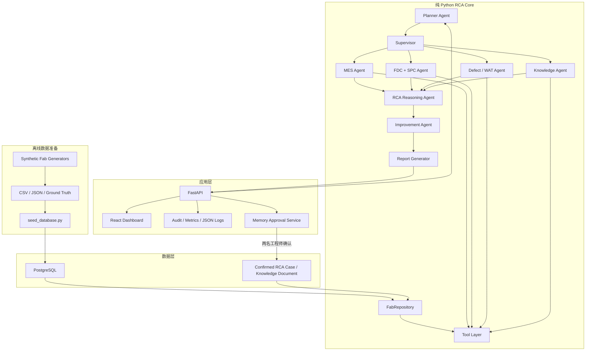
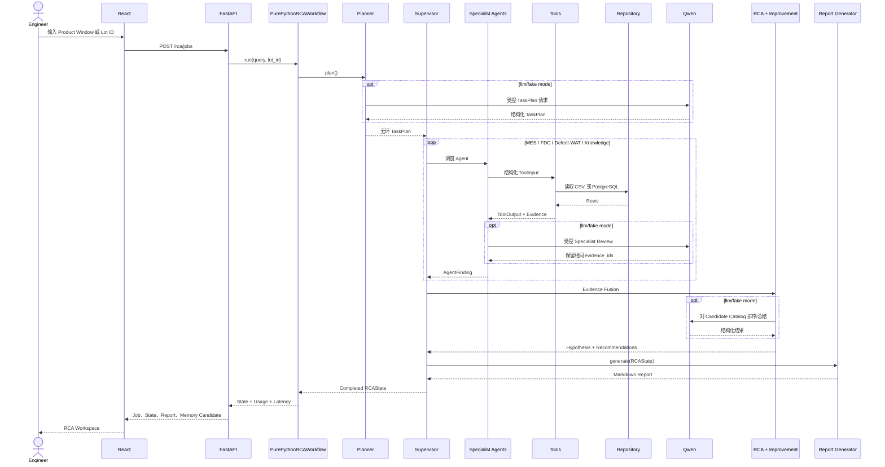
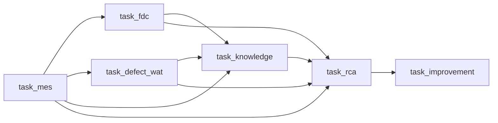

# Semiconductor Yield RCA Multi-Agent 项目架构与代码讲解

> 文档状态：基于当前仓库实际代码整理  
> 更新时间：2026-07-23  
> 当前运行形态：PostgreSQL + FastAPI + React + Qwen `qwen-plus` + `spc_case`

## 1. 文档目的

本文从工程实现角度说明这个项目是怎么做出来的，包括：

- 项目解决什么问题；
- 离线 Synthetic Fab 数据如何生成和导入；
- PostgreSQL、Repository、Tool、Agent、Workflow 如何分层；
- Planner、Supervisor、Specialist、RCA Reasoning、Improvement Agent 如何协作；
- SPC、RAG、Qwen、Memory Approval 分别处在什么位置；
- FastAPI 和 React 如何包装核心 Python Workflow；
- `LOT_A_015` 如何从异常 Lot 走到 Root Cause、Impact Lots 和报告；
- 当前代码已经实现什么、尚未实现什么；
- 如何运行、测试、排错和继续扩展。

本文以代码为准。早期设计文档中尚未落地的能力，不会被描述成已经实现。

### 阅读建议

可以按目标选择阅读范围：

| 目标 | 建议章节 |
|---|---|
| 先理解整个系统 | 2、3、6、28 |
| 理解 Python Agent 调用链 | 9 到 14 |
| 理解数据生成和数据库 | 7、8、10、11 |
| 理解 SPC | 15 |
| 理解 RAG 和知识审批 | 16、17 |
| 理解 API 和前端 | 18、19 |
| 运行和测试 | 22 到 24 |
| 继续开发 | 25 到 27 |

---

## 2. 项目背景与目标

半导体 Yield RCA 不是单一模型分类问题。工程师通常需要组合以下证据：

```text
异常 Lot / Yield Excursion
  -> MES Lot/Wafer Genealogy
  -> Equipment / Chamber / Recipe Commonality
  -> FDC Feature 和 OOC
  -> SPC Signal
  -> Defect / Metrology / WAT
  -> Historical RCA Case
  -> Root Cause 和 Impact Scope
  -> Containment / Corrective / Preventive Action
```

本项目把该调查流程实现为一个可追溯的 Multi-Agent 系统。系统提供两种调查入口：

### 2.1 Product Window 模式

输入产品和时间窗口，例如：

```text
Analyze the 40N_SOC yield drop from 2026-07-01 to 2026-07-31.
```

系统先从 WAT 识别失败 Lot，再分析它们的共同工艺暴露。

### 2.2 Lot-Driven 模式

输入一个已知异常 Lot，例如：

```text
LOT_A_015
```

系统先解析该 Lot 的完整上下文，再基于相同 Operation、Equipment、Chamber 和 Excursion
时间重叠寻找 Impact Lots。

### 2.3 最终输出

两种入口最终都生成同一种结构化结果：

- `RCAState`
- Agent Workflow Timeline
- Affected Lots / Impact Lots / Wafers
- Evidence Chain
- Root Cause 或 `inconclusive`
- Confidence
- SPC Evidence
- Recommended Actions
- Warnings
- Markdown Report
- 符合条件时生成待人工审批的 Memory Candidate

---

## 3. 当前实现范围

### 3.1 已实现

| 能力 | 当前实现 |
|---|---|
| Synthetic Fab | 三套离线数据集和对应生成器 |
| Fab Data Model | Lot、Wafer、Route、Operation、Equipment、Chamber、Recipe、Process History |
| Quality Data | Defect、Metrology、WAT |
| Equipment Data | FDC Feature Summary、OOC Event |
| SPC | Minimal SPC 兼容路径和 Advanced deterministic SPC |
| Knowledge | Confirmed RCA Case 和 Knowledge Document |
| Tool Layer | 结构化输入输出、Tool 延迟统计、Evidence 生成 |
| Agents | Planner、MES、FDC、Defect/WAT、Knowledge、RCA Reasoning、Improvement |
| Orchestration | 纯 Python Supervisor 和不可变 `RCAState` |
| LLM | DashScope `qwen-plus` 混合模式和 Fake LLM 测试模式 |
| Reporting | 可追溯 Markdown Report |
| Backend | FastAPI 同步 RCA Job API |
| Frontend | React Dashboard、ECharts SPC 图、报告下载、Memory 审批 |
| Memory | 双工程师审批后发布 Confirmed Knowledge |
| Observability | JSON Log、Prometheus Metrics、Audit、Token/Latency 统计 |
| Evaluation | 10 个离线场景和效果/延迟指标 |
| Deployment | Docker Compose：PostgreSQL、Backend、Frontend、显式 Seed Tool |

### 3.2 当前明确未实现

```text
Raw FDC Trace ingestion 和流式计算
Vision Agent / Wafer Map 图像分析
真实 MES/FDC/KLA/WAT Connector
实时 Kafka/Event Bus 数据接入
生产式 SPC Monitor、Alarm Acknowledge、自动 Hold/Release
通用 PDF/SOP 文档摄取
Embedding、pgvector、Semantic Top-K、Reranker
异步任务队列和持久化 RCA Job
企业 SSO、RBAC、可信工程师身份映射
生产级高可用、容量规划和正式 SLO
```

项目中的 Advanced SPC 是 **RCA 的确定性证据提供者**，不是一套独立的生产 SPC
闭环平台。

---

## 4. 技术栈

| 层 | 技术 |
|---|---|
| Core | Python 3.11+、标准 `dataclass` |
| API DTO | Pydantic 2 |
| Backend | FastAPI、Uvicorn |
| Database | PostgreSQL 16、Psycopg 3 |
| LLM | DashScope OpenAI-compatible API、Qwen `qwen-plus` |
| LLM HTTP | HTTPX |
| Frontend | React 19、TypeScript、Vite |
| Chart | ECharts |
| Markdown | React Markdown + GFM |
| Metrics | Prometheus Client |
| Test | Pytest、Vitest |
| Quality | Ruff、Mypy、TypeScript |
| Deployment | Docker Compose、Nginx |

核心 Python 模型没有依赖 FastAPI、Pydantic 或 ORM。这样同一条 RCA Workflow 可以在：

- CSV Seed；
- PostgreSQL；
- 命令行；
- FastAPI；
- 测试；

之间复用。

---

## 5. 仓库结构

```text
core/yield_rca_core/
  models.py                 Domain Model、DTO、RCAState
  repositories.py           CSV/PostgreSQL 只读数据访问
  tool_layer.py             工程 Tool 和 Evidence 生成
  specialist_agents.py      MES/FDC/Defect-WAT/Knowledge Agents
  planner_agent.py          TaskPlan 生成
  supervisor.py             Agent 调度和 State 维护
  rca_reasoning_agent.py    Evidence-based RCA
  improvement_agent.py      改进建议和 Fab-level Gate
  report_generator.py       Markdown Report
  workflow.py               Composition Root 和纯 Python 入口
  llm_gateway.py            Qwen/Fake LLM、Prompt、Token 统计
  spc_models.py             SPC DTO
  spc_engine.py             SPC 计算和 Nelson Rules
  evaluation.py             离线评估
  prompts/                  版本化结构化 Prompt

backend/yield_rca_api/
  app.py                    FastAPI Application
  schemas.py                API Request/Response
  store.py                  进程内 RCA Job Store
  audit.py                  Audit Sink
  observability.py          JSON Log 和 Prometheus
  memory.py                 Candidate、审批、发布

frontend/src/
  App.tsx                   页面状态和主工作区
  api.ts                    FastAPI Client
  selectors.ts              从 RCAState 提取展示数据
  types.ts                  TypeScript Contracts
  components/               Workflow、SPC、Evidence、Report、审批组件

db/migrations/
  001_initial_schema        Fab、Quality、Knowledge
  002_observability_audit   Audit、LLM Usage
  003_memory_approval       Memory Candidate 和审批
  004_advanced_spc_analytics Advanced SPC 和 OOC/Hold 关联

scripts/
  generate_synthetic_fab_data.py
  generate_synthetic_multi_case_data.py
  generate_synthetic_spc_data.py
  seed_database.py
  run_golden_rca.py
  run_evaluation.py

data/seeds/
  golden_case/
  multi_case/
  spc_case/
```

---

## 6. 总体架构



### 6.1 四条硬边界

1. Synthetic 数据生成器只在线下运行，FastAPI 启动时不会生成数据。
2. Agent 不允许直接访问 Repository 或 Database，只能调用 Tool。
3. React 只展示 API 返回的结果，不计算 SPC 或 RCA。
4. Qwen 不能创建新 Evidence，也不能绕过确定性的支持门槛和冲突检查。

### 6.2 在线请求时序



---

## 7. 离线 Synthetic Fab 数据

### 7.1 为什么先生成数据

Agent 的输入必须先有稳定、可校验的数据基础。项目执行顺序因此是：

```text
定义 Schema
  -> 生成离线 Dataset
  -> 校验 Ground Truth
  -> 导入 PostgreSQL
  -> 实现 Tool
  -> 实现 Agent
  -> 运行端到端 Workflow
```

数据生成不是在线 Agent 的职责，也不是 FastAPI 的后台任务。

### 7.2 三个生成器

| 脚本 | 作用 |
|---|---|
| `generate_synthetic_fab_data.py` | 最早的单一 Golden Product Window Case |
| `generate_synthetic_multi_case_data.py` | 75 个 Lot、25 Wafer/Lot、三个 Lot-driven Case |
| `generate_synthetic_spc_data.py` | 在 Multi Case 上增加 June Baseline、SPC Profile、OOC、Hold、Excursion |

`spc_case` 是当前最完整、最适合 Dashboard 验证的数据集。

### 7.3 当前完整 Process Flow

`spc_case/process_route.csv` 包含 30 个工序，关键顺序如下：

```text
Pre STI Wet Clean
  -> Pad Oxide Diffusion
  -> STI Nitride Deposition
  -> STI Lithography / Etch / Oxide Fill
  -> STI CMP
  -> Post STI CMP Wet Clean
  -> ILD Deposition
  -> ILD CMP
  -> Post ILD CMP Wet Clean
  -> Contact Lithography / Etch
  -> Pre W Wet Clean
  -> Barrier Liner Deposition
  -> W CVD Fill
  -> W Plug CMP
  -> Post W CMP Wet Clean
  -> Low-k IMD Deposition
  -> IMD CMP
  -> Post IMD CMP Wet Clean
  -> Cu Lithography / Trench Etch
  -> Pre Cu Wet Clean
  -> Barrier Seed Deposition
  -> Cu ECP Fill
  -> Cu CMP
  -> Post Cu CMP Wet Clean
  -> Post Cu CMP Inspection
  -> WAT
```

每个 Lot 都沿完整 Route 流动。Case 名称只表示异常场景，不再把 Lot 命名为
`LOT_WCMP_*` 或 `LOT_CU_*`。当前 Multi/SPC 数据使用 `LOT_A_001` 形式：

```text
LOT_A_001
    A   = Product code
    001 = Lot sequence
```

### 7.4 Equipment Capability 约束

生成器不是随机挑选任意 CMP。它通过以下主数据约束设备分配：

```text
process_route.operation_no
  -> operation_master.module/material
  -> equipment_capability.operation_no/module/material/recipe_family
  -> qualified equipment/chamber
```

因此：

- STI CMP 只使用 STI CMP capability；
- ILD CMP 只使用 ILD CMP capability；
- W CMP 只使用 W CMP capability；
- Cu CMP 只使用 Cu CMP capability；
- Cu CMP 不会错误分配到 STI/W/ILD CMP。

Cu、STI、ILD 和 IMD CMP 在当前主数据中按 Head 建模；例如
`CMP_CU03_CH01` 至 `CMP_CU03_CH04`。

### 7.5 Multi/SPC Case

| Source Lot | 场景 | 预期结果 |
|---|---|---|
| `LOT_A_015` | Cu CMP slurry excursion，跨 Lot | Supported |
| `LOT_A_038` | 单 Wafer 偶发 scratch | Inconclusive |
| `LOT_A_063` | 偶数 Wafer 厚度异常，前层 Thin Film 单 Chamber | Supported |

`spc_case` 还增加：

- Baseline Lots：`LOT_A_076` 到 `LOT_A_105`；
- Analysis Lots：`LOT_A_011` 到 `LOT_A_015`；
- Trigger Lot：`LOT_A_015`；
- Impact Lots：`LOT_A_011` 到 `LOT_A_014`；
- Trigger Hold：`HOLD_CU_OOC_001`；
- 每个 Impact Lot 独立的 containment Hold。

### 7.6 Dataset 的自校验

生成器写出：

```text
*.csv                  可导入结构化数据
ground_truth.json      预期 Root Cause、Scope、Evidence
case_catalog.json      可运行 Case 目录
spc_rule_ground_truth.json
```

生成脚本内部还检查：

- Wafer genealogy 是否完整；
- Equipment capability 是否匹配；
- OOC 是否只有一个 Trigger Lot；
- SPC Excursion 是否只有一个 Trigger Scope；
- 每个 Trigger/Impact Scope 是否有合法 Hold；
- 预期 Case 是否能被数据事实支撑。

---

## 8. PostgreSQL 数据架构

### 8.1 Migration 分层

| Migration | 主要表或变更 |
|---|---|
| `001_initial_schema` | Fab Master、Process、FDC、Quality、Knowledge |
| `002_observability_audit` | `audit_event`、`llm_usage_event` |
| `003_memory_approval` | `memory_candidate`、`memory_approval`、Confirmed 字段 |
| `004_advanced_spc_analytics` | `spc_baseline_profile`、`spc_excursion`、`spc_excursion_lot` |

### 8.2 表分组

**MES / Master Data**

```text
lot_master
wafer_master
operation_master
process_route
equipment_master
chamber_master
equipment_capability
recipe_master
recipe_history
process_history
hold_history
```

**FDC / SPC**

```text
fdc_feature
ooc_event
spc_baseline_profile
spc_excursion
spc_excursion_lot
```

**Quality**

```text
defect_summary
metrology_result
wat_result
```

**Knowledge / Memory**

```text
rca_case
knowledge_document
memory_candidate
memory_approval
```

**Observability**

```text
audit_event
llm_usage_event
```

### 8.3 为什么 `process_history` 是核心

`process_history` 以 Wafer-operation 粒度关联：

```text
Lot
Wafer
Route
Operation
Module
Equipment
Chamber
Recipe ID / Version
Start / End Time
Process Result
```

Lot-driven RCA 的 Impact Scope 不是硬编码，而是根据该表中的：

```text
same operation
+ same equipment
+ same chamber
+ process-time overlap with excursion window
```

计算出来。

### 8.4 Seed 流程

`scripts/seed_database.py`：

1. 按顺序执行 down migration；
2. 按顺序执行 up migration；
3. 按外键依赖顺序读取 CSV；
4. 处理 PostgreSQL Array 字段；
5. 批量插入；
6. 提交事务。

它是显式离线命令。Backend 容器没有 Dataset Generator，也不会在启动时重置数据库。

---

## 9. Domain Model 与 RCAState

核心合同位于：

- `core/yield_rca_core/models.py`
- `core/yield_rca_core/spc_models.py`
- `core/yield_rca_core/memory_models.py`

### 9.1 统一模型模式

模型使用冻结的 `dataclass`：

```python
@dataclass(frozen=True)
class AgentFinding:
    finding_id: str
    agent: str
    summary: str
    confidence: float
    evidence_ids: list[str]
    details: dict[str, Any]
    warnings: list[Warning]
```

每个模型都提供：

```text
__post_init__ validation
to_dict()
from_dict()
schema_version
```

这样可以在 Agent、API、JSON Artifact 和 React 之间稳定序列化。

### 9.2 Evidence

```python
@dataclass(frozen=True)
class Evidence:
    evidence_id: str
    source_type: str
    source_id: str
    summary: str
    source_table: str | None
    source_field: str | None
    timestamp: str | None
    metadata: dict[str, Any]
```

Evidence 记录“结论来自哪里”，例如：

```text
EV_MES_COMMON_CHAMBER
  source_table = process_history

EV_FDC_SLURRY_FLOW
  source_table = fdc_feature

EV_SPC_OOC_CONTEXT
  source_table = spc_excursion

EV_KNOWLEDGE_MATCH
  source_table = rca_case
```

### 9.3 RCAState

`RCAState` 是单个 RCA Job 的 Short-term Memory：

```python
RCAState(
    job=...,
    task_plan=...,
    completed_task_ids=...,
    affected_lots=...,
    impact_lots=...,
    affected_wafers=...,
    impact_wafers=...,
    impact_criteria=...,
    evidence=...,
    findings=...,
    hypotheses=...,
    warnings=...,
    report=...,
    llm_usage=...,
    execution_metadata=...,
)
```

它会验证：

- Evidence ID 不重复；
- Finding、Warning、Hypothesis、Report 引用的 Evidence 必须存在；
- Completed Task 必须属于 TaskPlan；
- Source Lot 不能重复出现在 `impact_lots`；
- Confidence 必须在 0 到 1 之间。

这使“Evidence 可追溯”成为数据合同，而不是只靠 Prompt 提醒。

---

## 10. Repository Layer

代码：`core/yield_rca_core/repositories.py`

统一接口只有一个读操作：

```python
class FabRepository(Protocol):
    def rows(self, table_name: str) -> list[Row]:
        ...
```

当前实现：

| Repository | 用途 |
|---|---|
| `CsvFabRepository` | 离线 Seed、纯 Python Workflow、测试 |
| `PostgresFabRepository` | FastAPI / Docker 运行 |

支持的表名使用 Allowlist，不能传入任意 SQL 表名。

### 10.1 当前限制

`PostgresFabRepository.rows()` 当前执行：

```sql
SELECT * FROM <allowed_table>
```

然后 Tool 在 Python 中过滤。这对 MVP 和小型 Synthetic Dataset 可用，但不适合真实 Fab
规模。生产演进时应把 Repository 改为参数化、分页、按时间和索引条件下推的专用查询，
而不改变 Agent 和 Tool 合同。

---

## 11. Tool Architecture

代码：`core/yield_rca_core/tool_layer.py`

### 11.1 Tool 的职责

Tool 不是通用 `query_table()`，而是工程能力：

```text
get_lot_context
find_impact_lots
analyze_lot_genealogy
analyze_parameter_shift
analyze_spc_evidence
summarize_defect_wat
retrieve_similar_case
```

输入输出都使用结构化 DTO：

```python
ToolInput(
    tool_name=...,
    request_id=...,
    parameters=...,
    requested_by=...,
)

ToolOutput(
    success=True,
    data=...,
    evidence_ids=...,
    warnings=...,
)
```

### 11.2 Tool 与 Agent 对应关系

| Agent | Tool | 主要数据 |
|---|---|---|
| MES | `find_affected_lots` | `lot_master`、`wat_result`、`fdc_feature` |
| MES | `get_lot_context` | Lot、Process、WAT、Defect、Hold、FDC、Metrology、Recipe |
| MES | `find_impact_lots` | `process_history`、`fdc_feature`、`ooc_event` |
| MES | `analyze_lot_genealogy` | `process_history`、`hold_history` |
| FDC | `analyze_parameter_shift` | `fdc_feature` |
| FDC | `find_ooc_events` | `ooc_event`、SPC Excursion、Hold |
| FDC | `perform_basic_spc_analysis` | FDC Feature 和自动选择的历史 Reference |
| FDC | `analyze_spc_evidence` | Versioned SPC Profile、FDC/WAT、Excursion |
| Defect/WAT | `summarize_defect_wat` | Defect、Metrology、WAT |
| Knowledge | `retrieve_similar_case` | Confirmed RCA Case、Knowledge Document |

### 11.3 Tool 延迟

每个 `run()` 由 `_measure_tool_latency` 装饰。结果写入：

```text
RCAState.execution_metadata.tool_latencies
Prometheus tool_calls_total
Prometheus tool_duration_seconds
JSON logs
```

---

## 12. Agent Architecture

### 12.1 Planner Agent

代码：`core/yield_rca_core/planner_agent.py`

Planner 只做：

- 解析用户问题；
- 判断 `product_window` 或 `lot`；
- 提取 `product_id`、`lot_id`、时间窗口；
- 生成结构化 `TaskPlan`。

当前默认计划：



`TaskPlan` 在构造时校验：

- Task ID 唯一；
- 依赖必须存在；
- 任务图无环；
- Agent 必须属于注册集合。

Planner 不查询数据库、不调用 Tool、不输出 Root Cause。

### 12.2 MES Agent

代码：`MESAgent` in `specialist_agents.py`

Product Window：

```text
find_affected_lots
  -> analyze_lot_genealogy
  -> Affected/Normal/Suspect Lots
  -> target operation/equipment/chamber/recipe
```

Lot-Driven：

```text
get_lot_context
  -> find_impact_lots
  -> analyze_lot_genealogy
  -> Source Lot + Impact Lots/Wafers + Exposure Criteria
```

### 12.3 FDC Agent

代码：`FDCAgent` in `specialist_agents.py`

调用：

```text
analyze_parameter_shift
+ find_ooc_events
+ advanced SPC（有 profile 时）
  或 minimal SPC（兼容路径）
```

输出包含 Parameter Summary、OOC、SPC Results 和 SPC/Hold Context。

### 12.4 Defect/WAT Agent

代码：`DefectWATAgent`

组合：

```text
Defect Type / Pattern
Metrology Outlier
Odd/Even Wafer Average
WAT Fail Mode
Physical-Electrical Consistency
```

没有正信号时也会生成可追溯的负证据 `EV_QUALITY_NO_IMPACT`，避免空 Finding。

### 12.5 Knowledge Agent

代码：`KnowledgeAgent`

只调用 `RetrieveSimilarCaseTool`。它不会直接查询 PostgreSQL，也不会让 Qwen自由生成历史案例。

### 12.6 RCA Reasoning Agent

代码：`core/yield_rca_core/rca_reasoning_agent.py`

当前 Evidence Scoring：

| 组件 | 权重 |
|---|---:|
| MES commonality | 0.30 |
| FDC / SPC | 0.30 |
| Defect / WAT / Metrology | 0.20 |
| Confirmed Historical Knowledge | 0.20 |

FDC 强度使用最强三个诊断参数，避免大量稳定控制参数把真实异常平均掉：

```python
diagnostic_signals = sorted(parameter_signals, reverse=True)[:3]
parameter_signal = sum(diagnostic_signals) / len(diagnostic_signals)
fdc_strength = 0.8 * parameter_signal + 0.2 * ooc_signal
```

支持结论还必须通过确定性门槛：

```text
MES strength >= 0.8
FDC strength >= 0.6
Defect/WAT strength >= 0.6
Final score >= 0.75
No conflicting physics
Candidate matches deterministic canonical candidate
```

否则返回：

```text
root_cause = inconclusive
WARN_RCA_INCONCLUSIVE
```

历史 Case 即使高度相似，也不能单独把结论提升为 `supported`。

### 12.7 Improvement Agent

代码：`core/yield_rca_core/improvement_agent.py`

在 RCA Reasoning 后执行，输出五层建议：

1. Containment Actions
2. Corrective Actions
3. Recipe Optimization
4. Preventive Actions
5. Fab/System Optimization

Fab-level 结论要求：

```text
RCA supported
+ 至少一个：
   - cross-Lot evidence
   - 与当前 root cause 对齐的 confirmed historical case
```

Recipe 建议只允许提出 DOE、Split-Lot、Qualification 和工程审核，不直接修改生产 Recipe。

### 12.8 Report Generator

代码：`core/yield_rca_core/report_generator.py`

Report Generator 不调用 LLM，也不访问数据库。它只从 `RCAState` 渲染：

```text
Problem Summary
Affected Lots / Impact Scope
Evidence Chain
SPC Evidence
Root Cause
Confidence
Engineering Summary
五类 Recommended Actions
Memory Status
Warnings
Referenced Records
```

生成前会校验所有引用的 Evidence ID 都存在。

---

## 13. Supervisor 与纯 Python Workflow

### 13.1 Composition Root

代码：`core/yield_rca_core/workflow.py`

`build_workflow()` 完成所有依赖装配：

```text
Repository
  -> Tools
  -> Specialist Agents
  -> RCA Reasoning
  -> Improvement
  -> Report Generator
  -> Supervisor
  -> Planner
  -> PurePythonRCAWorkflow
```

同一套 Core 可用两种数据源：

```python
build_csv_workflow(seed_dir)
build_postgres_workflow(database_url)
```

### 13.2 Supervisor

代码：`core/yield_rca_core/supervisor.py`

Supervisor：

1. 校验 TaskPlan 只包含注册 Agent；
2. 找出依赖已完成的 Ready Task；
3. 调度对应 Agent；
4. 合并 Evidence 和 Warning；
5. 验证 Finding 的 Evidence Payload；
6. 更新不可变 `RCAState`；
7. RCA 完成后运行 Improvement；
8. 生成 Report；
9. 将 Job 标为 `completed`。

如果任何 Task 失败，Supervisor 会保留 Failed State 和 Task 状态，并抛出
`SupervisorExecutionError`。

### 13.3 Workflow Metadata

`PurePythonRCAWorkflow.run()` 使用 Context Manager 捕获：

```text
LLM usage
Tool latency
Total token
LLM latency
Tool call count
Workflow duration
```

这些数据写入 `RCAState.execution_metadata`，供 API、Dashboard、Metrics 和 Audit 使用。

---

## 14. Qwen 混合 Agent 架构

代码：`core/yield_rca_core/llm_gateway.py`

### 14.1 三种模式

```text
deterministic  完全不调用 LLM
fake           走完整 LLM Contract，但无网络和费用
llm            调用 DashScope qwen-plus
```

### 14.2 Qwen 实际参与的位置

| 节点 | Qwen 可以做什么 | Qwen 不可以做什么 |
|---|---|---|
| Planner | 在固定 Agent 集合内输出 TaskPlan | 增加未知 Agent、查询数据、生成 RCA |
| Specialist Review | 改写 Summary、给工程解释 | 改动 Tool Evidence ID |
| RCA Reasoning | 对确定性 Candidate Catalog 排序和总结 | 发明 Candidate、引用未知 Evidence、决定绕过 Gate |
| Improvement | 生成 Engineering Summary | 增删 Recommendation ID 或 Evidence ID |

Report Generator、SPC Engine、Tool 和数据库查询仍然是确定性的。

### 14.3 结构化输出校验

DashScope 使用：

```json
{
  "response_format": {"type": "json_object"},
  "temperature": 0.0
}
```

模型响应必须通过 JSON 和 Domain Contract 校验。违反合同会返回：

```text
LLM_OUTPUT_INVALID
```

不会静默退回一个不受控的自然语言答案。

### 14.4 Prompt 版本

```text
prompts/planner_v1.md
prompts/specialist_v1.md
prompts/improvement_v1.md
```

Prompt Version 和 Token Usage 会记录到 `RCAState`、Audit 和 Prometheus。

### 14.5 Provider Error

Backend 把错误分类为：

```text
LLM_BILLING_ERROR
LLM_AUTH_FAILED
LLM_RATE_LIMITED
LLM_PROVIDER_ERROR
LLM_UNAVAILABLE
LLM_OUTPUT_INVALID
```

日志会清洗 API Key、Bearer Token 和 Provider Diagnostic，避免泄露密钥。

---

## 15. SPC Architecture

### 15.1 两条 SPC 路径

**Minimal SPC**

- 从历史正常 FDC Feature 自动寻找 Reference；
- Mean ± 3 Sigma；
- Point Beyond 3 Sigma；
- Same-side Run；
- Monotonic Trend；
- 用于没有 Versioned Profile 的旧 Dataset。

**Advanced SPC**

- 严格使用 `spc_baseline_profile`；
- 完整上下文匹配；
- I-MR、Xbar-S、Xbar-R、p-chart；
- Nelson Rules 1-8；
- 有 Spec 时计算 Cp/Cpk、Pp/Ppk；
- 过程不稳定时 Capability 只标记为 informational。

### 15.2 Baseline 严格匹配

```text
Product
+ Operation
+ Equipment
+ Chamber/Head
+ Recipe ID
+ Recipe Version
+ Parameter
```

系统不会为了凑 Baseline 而混用不同 Chamber、Recipe 或不同 CMP Module。

### 15.3 OOC、Trigger Lot 和 Impact Lot

项目采用以下语义：

```text
一个 SPC Rule Violation
  -> 一个 OOC Event
  -> 一个 Trigger Lot
  -> 可选 Trigger Wafer
  -> 一个 Trigger Hold
  -> 一个 Excursion
       -> 0..N 个 Impact Lots
       -> 每个 Impact Lot 有自己的 containment Hold
```

Impact Lot 不是“另一个 OOC Owner”。它只是位于该 Excursion 暴露窗口内、需要独立
Hold 和 disposition 的 Lot。

### 15.4 SPC 在 RCA 中的位置

SPC 只形成 `EV_SPC_*` Evidence。它不会：

- 自动调用 MES Hold API；
- 自动 Release；
- 修改 Recipe；
- 替代 FDC、Defect、WAT 或 Engineering Review。

---

## 16. RAG 与 Knowledge Architecture

更详细的专项说明见：

- `docs/rag-architecture-code-guide.md`

### 16.1 当前真实实现

当前不是 pgvector RAG，而是：

```text
当前 MES/FDC/Defect/WAT 事实
  -> Supervisor 生成工程 Query
  -> Confirmed RCA Case metadata + keyword score
  -> 读取最佳 Case 关联的 Knowledge Document
  -> EV_KNOWLEDGE_MATCH
  -> RCA Evidence Fusion
```

检索 Query 组合：

```text
module
equipment type
FDC parameter names
defect types
WAT fail modes
metrology metric names
recipe change
```

### 16.2 当前评分

`RetrieveSimilarCaseTool`：

```text
每个 query token 命中 searchable text: +0.08
module match:                         +0.25
equipment type exact match:           +0.20
case confidence floor: confidence * 0.8
maximum:                               0.99
```

这里的 `similarity` 是启发式匹配分，不是 cosine similarity 或校准概率。

### 16.3 Confirmed Gate

只有：

```text
rca_case.validation_status = CONFIRMED
knowledge_document.validation_status = CONFIRMED
```

才可被 Knowledge Tool 检索。Pending Memory Candidate 不会进入下一次 RCA。

### 16.4 后续 RAG 演进

推荐保持现有接口，只替换 Tool 内部实现：

```text
Metadata Filter
  -> Keyword/BM25
  -> pgvector Embedding Search
  -> Hybrid Merge
  -> Reranker
  -> Confirmed Gate
  -> Evidence
```

还需要增加 Document Ingestion、Chunk、Embedding Version、Source ACL 和 Re-index
机制。

---

## 17. Memory Approval 与知识写回

代码：

- `core/yield_rca_core/memory_models.py`
- `backend/yield_rca_api/memory.py`
- `db/migrations/003_memory_approval.up.sql`

### 17.1 Candidate 生成条件

只有 `supported` RCA 才生成 Memory Candidate：

```text
Completed RCAState
  -> Improvement Finding
  -> memory_candidate(status=pending_approval)
```

`inconclusive` 不创建可发布知识。

### 17.2 审批规则

- Event-level 和 Fab-level 都需要两名不同工程师；
- 同一 Engineer ID 只能决定一次；
- 任一 Reject 立即终止 Candidate；
- 有 Recipe Optimization 时，两名审批人中必须至少有一名 Process Engineer；
- API 中的 Engineer ID 目前仍是请求字段，不是可信 SSO Identity。

### 17.3 发布事务

第二个合法 Approval 到达后，在一个 PostgreSQL Transaction 中：

```text
insert memory_approval
insert rca_case(validation_status=CONFIRMED)
insert knowledge_document(validation_status=CONFIRMED)
update memory_candidate(status=published)
```

这条新 Case 才能被未来的 Knowledge Agent 检索。

### 17.4 持久化差异

| 运行模式 | Candidate/Approval |
|---|---|
| CSV | In-memory，重启丢失，不能修改静态 CSV |
| PostgreSQL | 持久化并发布回知识表 |

---

## 18. FastAPI Backend

代码：`backend/yield_rca_api/app.py`

### 18.1 定位

FastAPI 是纯 Python Workflow 的 HTTP Adapter：

```text
HTTP Request
  -> Pydantic validation
  -> PurePythonRCAWorkflow.run()
  -> InMemoryRCAJobStore
  -> HTTP Response
```

FastAPI 不生成 Synthetic Fab 数据，也不实现第二套 RCA 逻辑。

### 18.2 API

| Method | Path | 作用 |
|---|---|---|
| `POST` | `/rca/jobs` | 同步执行 RCA Job |
| `GET` | `/rca/jobs/{job_id}` | 获取完整 RCAState |
| `GET` | `/rca/jobs/{job_id}/report` | 获取 Markdown Report |
| `GET` | `/rca/jobs/{job_id}/memory-candidate` | 按 Job 获取 Candidate |
| `GET` | `/memory/candidates/{candidate_id}` | 获取 Candidate |
| `POST` | `/memory/candidates/{candidate_id}/approvals` | 审批或拒绝 |
| `GET` | `/health` | Liveness |
| `GET` | `/ready` | Agent Mode、Model、Dataset |
| `GET` | `/metrics` | Prometheus |

### 18.3 同步执行

`POST /rca/jobs` 当前会等待完整 Workflow 结束后才返回 `201`。因此：

- Backend 内部确实逐 Task 执行；
- 但前端拿到 Job 时通常已经完成；
- 当前 Timeline 主要展示执行结果，不是实时 Streaming Timeline。

未来要实现实时进度，需要引入：

```text
durable job table
+ worker queue
+ background execution
+ WebSocket/SSE
```

### 18.4 Job Store

`InMemoryRCAJobStore` 保存 `RCAState`：

- 线程安全；
- API 重启后 Job 消失；
- 不影响 Fab 数据、Audit、Memory Candidate 和 Confirmed Knowledge 的 PostgreSQL 持久化。

---

## 19. React Dashboard

代码入口：

- `frontend/src/App.tsx`
- `frontend/src/api.ts`
- `frontend/src/types.ts`
- `frontend/src/selectors.ts`

### 19.1 数据流

```text
JobComposer
  -> POST /rca/jobs
  -> GET RCAState + Report + optional Memory Candidate
  -> React State
  -> Selector
  -> Presentation Components
```

### 19.2 组件

| 组件 | 展示内容 |
|---|---|
| `JobComposer` | Product Window / Lot-Driven 输入 |
| `WorkflowTimeline` | 六个 Task 的状态 |
| `YieldTrendChart` | Product Window Yield Trend |
| `LotImpactPanel` | Lot-driven Impact Scope |
| `RootCausePanel` | Root Cause、Confidence、FDC Shift、Actions |
| `SpcEvidencePanel` | SPC Chart、Rule、Baseline、Trigger/Impact Hold |
| `EvidenceChain` | Agent Claim 到 Evidence Record |
| `RuntimeMetadata` | Mode、Model、Prompt、Tokens、Latency、Tool Calls |
| `MemoryApprovalPanel` | 两名工程师审批 |
| `ReportView` | Markdown 渲染和 `.md` 下载 |

### 19.3 SPC 图

`SpcEvidencePanel` 使用 ECharts Canvas 显示：

- Analysis Series；
- CL/UCL/LCL；
- USL/LSL；
- Violation Sample；
- Nelson Rule；
- Baseline ID 和 Window；
- Trigger Lot/Hold；
- Impact Lot/Hold。

所有 Control Limit 和 Rule Result 来自 Backend。React 不重新计算。

---

## 20. Observability、Audit 与 Token

### 20.1 JSON Log

`backend/yield_rca_api/observability.py` 输出结构化字段：

```text
correlation_id
job_id
task_id
agent
tool_request_id
lot_id
duration_ms
outcome
error_code
provider diagnostic
```

HTTP Middleware 会接受或生成 `X-Correlation-ID`，并在 Response Header 返回。

### 20.2 Prometheus Metrics

```text
rca_jobs_total
rca_job_duration_seconds
tool_calls_total
tool_duration_seconds
llm_calls_total
llm_tokens_total
llm_duration_seconds
llm_errors_total
inconclusive_total
```

Token 分为 Prompt 和 Completion；`RCAState.llm_usage` 还记录：

```text
cached_tokens
reasoning_tokens
latency_ms
status
prompt_version
```

### 20.3 Audit

PostgreSQL 记录：

```text
RCA_JOB_CREATED
RCA_JOB_COMPLETED
RCA_JOB_FAILED
RCA_REPORT_VIEWED
MEMORY_CANDIDATE_CREATED
MEMORY_APPROVAL_RECORDED
MEMORY_CANDIDATE_PUBLISHED
MEMORY_CANDIDATE_REJECTED
```

Audit 是 best-effort。Telemetry 写入失败会记录 Warning，但不会改变 RCA Evidence、
Confidence 或 Root Cause。

---

## 21. 离线 Evaluation

代码：

- `core/yield_rca_core/evaluation.py`
- `scripts/run_evaluation.py`
- `data/evaluation/scenarios.json`

场景：

```text
CMP slurry flow decline
Recipe version change
Single chamber abnormality
Scratch defect + WAT fail
MES commonality but no FDC abnormality
FDC drift but no yield impact
Conflicting evidence
Missing data
High historical case match
Inconclusive root cause
```

指标：

```text
Top-1 root cause accuracy
Top-3 recall
Inconclusive handling rate
Evidence traceability
Hallucinated citation rate
Confidence calibration
Tool latency
End-to-end latency
Impact scope accuracy
Warning recall
```

这套 Evaluation 使用 Scenario Repository 投影，仍然复用相同的 Tool、Agent、Supervisor、
Reasoning 和 Report 路径。

---

## 22. `LOT_A_015` 端到端代码路径

### 22.1 请求

```json
{
  "investigation_mode": "lot",
  "lot_id": "LOT_A_015"
}
```

### 22.2 Planner

`PlannerAgent.plan()` 生成：

```text
task_mes
task_fdc
task_defect_wat
task_knowledge
task_rca
task_improvement
```

### 22.3 MES

`MESAgent.analyze_lot()`：

1. `GetLotContextTool` 解析 Product、Route、WAT、Recipe；
2. `FindImpactLotsTool` 选择 Cu CMP Operation `6400`；
3. 根据 `CMP_CU03/CMP_CU03_CH02` 和 Excursion Window 找到 Impact Lots；
4. `AnalyzeLotGenealogyTool` 确认共同 Chamber 和 Hold。

结果：

```text
Source Lot:
  LOT_A_015

Impact Lots:
  LOT_A_011
  LOT_A_012
  LOT_A_013
  LOT_A_014

Scope:
  mixed
```

### 22.4 FDC / SPC

`FDCAgent.analyze()` 得到：

- Slurry Flow 下降；
- Endpoint Time、Removal Rate 等协同变化；
- OOC Event；
- SPC Rule Violation；
- Trigger Hold；
- Impact Holds。

典型 Evidence：

```text
EV_FDC_SLURRY_FLOW
EV_FDC_ESTIMATED_REMOVAL_RATE
EV_OOC_EVENTS
EV_SPC_OOC_CONTEXT
EV_SPC_SLURRY_FLOW
```

### 22.5 Defect / WAT

得到：

```text
EV_DEFECT_CU_RESIDUE
EV_WAT_LEAKAGE_SHORT
```

这提供 Physical/Electrical Impact，避免只凭设备参数就下结论。

### 22.6 Knowledge

Supervisor 使用当前证据生成 Query，Knowledge Tool 返回：

```text
EV_KNOWLEDGE_MATCH
```

历史 Case 只是 20% 支持证据。

### 22.7 RCA

当前回归验证结果：

```text
status      = supported
root_cause  = CMP_CU03_CH02 slurry delivery degradation
confidence  = 0.950
impact_lots = LOT_A_011..LOT_A_014
warnings    = []
```

### 22.8 Improvement 与 Report

Improvement Agent 输出 containment、corrective、recipe、preventive 和 Fab-level 建议；
Report Generator 把所有结论和 Evidence ID 写入 Markdown。

### 22.9 Memory

因为 RCA 是 `supported`，FastAPI 创建 `pending_approval` Candidate。两名不同工程师
确认后，它成为新的 `CONFIRMED` RCA Case。

---

## 23. Docker Compose 运行方式

### 23.1 当前本机配置

当前 `.env` 的非密钥运行配置为：

```text
YIELD_RCA_DATASET=spc_case
YIELD_RCA_AGENT_MODE=llm
YIELD_RCA_LLM_PROVIDER=dashscope
YIELD_RCA_LLM_MODEL=qwen-plus
BACKEND_PORT=8001
FRONTEND_PORT=5174
```

`DASHSCOPE_API_KEY` 必须保存在 `.env`，不能写入代码、日志或文档。

### 23.2 完整离线准备和启动

在项目根目录：

```powershell
# 1. 显式生成离线数据；不是每次启动都必须执行
.\.venv\Scripts\python.exe scripts\generate_synthetic_spc_data.py

# 2. 启动数据库
docker compose up -d db

# 3. 显式执行 migration + seed
docker compose --profile tools run --rm seed

# 4. 构建并启动应用
docker compose up --build -d backend frontend

# 5. 查看状态
docker compose ps
```

当前地址：

```text
Dashboard: http://127.0.0.1:5174
API Docs:  http://127.0.0.1:8001/docs
Ready:     http://127.0.0.1:8001/ready
Metrics:   http://127.0.0.1:8001/metrics
```

### 23.3 为什么 Seed 是单独服务

Compose 中：

```text
db        正常长期运行
backend   只读分析数据库，不生成数据
frontend  Nginx 托管 React，/api 反向代理到 backend
seed      profile=tools，只在显式命令下运行
```

这防止 Backend 重启时意外重置数据库。

### 23.4 停止

```powershell
docker compose down
```

保留 PostgreSQL Volume。需要连 Volume 一起删除时必须明确确认数据可以丢弃。

---

## 24. 本地开发和测试

### 24.1 Python

```powershell
python -m venv .venv
.\.venv\Scripts\python.exe -m pip install -e ".[dev]"
```

纯 Python RCA：

```powershell
.\.venv\Scripts\python.exe scripts\run_golden_rca.py `
  --seed-dir data\seeds\spc_case `
  --query "Analyze abnormal Lot LOT_A_015 and identify impact Lots." `
  --no-print-report
```

### 24.2 Test

```powershell
.\.venv\Scripts\python.exe -m pytest -q
```

最近一次完整 Pytest 验证：

```text
170 passed, 3 skipped
```

三个 Skip 是需要可选外部环境的测试，不表示核心功能失败。

### 24.3 Evaluation

```powershell
.\.venv\Scripts\python.exe scripts\run_evaluation.py
```

输出：

```text
outputs/evaluation/results.json
outputs/evaluation/report.md
```

### 24.4 Frontend

```powershell
Set-Location frontend
pnpm install
pnpm run check
pnpm run build
```

当前变更相关的 Ruff/Mypy 检查已通过；全仓库静态检查仍有早期代码遗留问题，因此不能把
全仓库 Ruff/Mypy 描述为全部通过。

---

## 25. 当前限制与风险

### 25.1 数据真实性

数据是经过工程规则约束的 Synthetic Dataset，不等于真实 Fab 的分布、缺失模式、延迟和
噪声。当前准确率只说明流程和 Case Contract 正确。

### 25.2 Confidence

当前 Confidence 来自 Evidence Scoring 和门槛，不是基于大量真实 Case 校准的失效概率。

### 25.3 Repository 性能

PostgreSQL 当前按表全量读取再在 Python 过滤，真实数据量下必须改为查询下推。

### 25.4 API 同步执行

Qwen 慢或超时时，`POST /rca/jobs` 会一直等待。当前没有 Worker、Retry Queue 和实时 Timeline。

### 25.5 Job 不持久

RCA Job State 在内存中，Backend 重启会丢失；Memory Candidate、Approval、Audit 和 Confirmed
Knowledge 在 PostgreSQL 中持久化。

### 25.6 RAG 不是向量检索

当前是 Confirmed Metadata + Keyword Retrieval。文档数量增加后需要 pgvector/BM25/Reranker。

### 25.7 Security

当前审批请求中的 Engineer ID 和 Role 可由客户端填写。上线前必须接企业身份、RBAC、审计
权限和数据访问控制。

### 25.8 SPC 边界

SPC 只分析已有数据并解释已建模的 OOC/Hold 关系，不连接真实 SPC 或 MES 执行 Hold。

### 25.9 LLM 可用性

真实 Qwen 模式受 API Key、权限、账户余额、配额、网络和模型输出格式影响。系统会明确失败，
不会无提示地把 LLM 错误当成确定性成功。

---

## 26. 推荐后续演进顺序

### Phase A：巩固当前 Demo

1. 修复全仓库 Ruff/Mypy 遗留问题；
2. 增加更多 Lot-driven Regression Cases；
3. 增加 PostgreSQL 查询级性能测试；
4. 把当前 README 中旧的 Step/Case 描述更新为 Advanced SPC 现状。

### Phase B：可部署应用

1. 持久化 RCA Job 和 Task Status；
2. 引入 Worker Queue；
3. 使用 SSE/WebSocket 展示实时 Agent Timeline；
4. 增加 SSO、RBAC、Engineer Identity；
5. 增加 Trace ID 和 OpenTelemetry；
6. 对 Report、Approval、Knowledge 实施访问控制。

### Phase C：真实数据接入

1. 定义 MES/FDC/KLA/WAT Connector Contract；
2. 建立 Staging、Quality Check 和 Analysis-ready Data Mart；
3. Repository 查询下推和时间分区；
4. 数据血缘、时区、延迟、补数和重放；
5. 先做 Read-only Shadow Mode，不自动写回生产系统。

### Phase D：RAG 升级

1. SOP/Engineering Note/RCA Document Ingestion；
2. Chunk 和 Metadata Schema；
3. pgvector Embedding；
4. Keyword + Vector Hybrid Retrieval；
5. Reranker；
6. Confirmed Gate、ACL 和 Citation 保持不变。

### Phase E：高级分析

1. Equipment Health Modeling；
2. Raw FDC Trace 的离线特征工程；
3. Wafer Map 和 Vision Agent；
4. 更大规模 Confidence Calibration；
5. 经工程审核的 Bayesian/ML RCA 模型。

---

## 27. 代码导航

| 想理解的内容 | 先看文件 | 关键对象 |
|---|---|---|
| 整个 Workflow 如何装配 | `core/yield_rca_core/workflow.py` | `build_workflow`、`PurePythonRCAWorkflow` |
| State 和 Evidence 合同 | `core/yield_rca_core/models.py` | `Evidence`、`AgentFinding`、`RCAState` |
| Planner | `core/yield_rca_core/planner_agent.py` | `PlannerAgent.plan` |
| Supervisor | `core/yield_rca_core/supervisor.py` | `Supervisor.execute`、`_dispatch` |
| Specialist | `core/yield_rca_core/specialist_agents.py` | 四个 Specialist Agent |
| Tool | `core/yield_rca_core/tool_layer.py` | 所有 `*Tool` |
| Database Adapter | `core/yield_rca_core/repositories.py` | `CsvFabRepository`、`PostgresFabRepository` |
| RCA 决策 | `core/yield_rca_core/hypothesis_engine.py` | `HypothesisEngine`、Decision Gate |
| Improvement | `core/yield_rca_core/improvement_agent.py` | `ImprovementAgent` |
| SPC | `core/yield_rca_core/spc_engine.py` | `calculate_imr`、`calculate_xbar`、`calculate_p_chart` |
| Qwen | `core/yield_rca_core/llm_gateway.py` | `DashScopeLLMClient`、`LLMSettings` |
| Report | `core/yield_rca_core/report_generator.py` | `ReportGenerator` |
| API | `backend/yield_rca_api/app.py` | `create_app` |
| Memory | `backend/yield_rca_api/memory.py` | `MemoryApprovalService` |
| Observability | `backend/yield_rca_api/observability.py` | `RCAMetrics`、`JsonFormatter` |
| Dashboard | `frontend/src/App.tsx` | `App`、`InvestigationView` |
| SPC UI | `frontend/src/components/SpcEvidencePanel.tsx` | `SpcEvidencePanel` |
| Approval UI | `frontend/src/components/MemoryApprovalPanel.tsx` | `MemoryApprovalPanel` |
| Data Generator | `scripts/generate_synthetic_spc_data.py` | `generate_dataset` |
| Seed | `scripts/seed_database.py` | `seed_database` |
| Evaluation | `core/yield_rca_core/evaluation.py` | `evaluate_scenarios` |

---

## 28. 一句话理解整个项目

这个项目不是“让 LLM 自由猜 Root Cause”，而是：

```text
先用离线可验证的 Fab 数据和确定性 Tool 形成事实
  -> 用 Multi-Agent 按工程流程组织调查
  -> 用 Evidence Scoring 和 Conflict Gate 决定 supported/inconclusive
  -> 用 Qwen 在受控候选和 Evidence 范围内做结构化解释
  -> 生成可追溯报告
  -> 经两名工程师确认后把 Case 写回长期知识库
```

这种架构保留了 AI Agent 的规划、解释和协作能力，同时把工业系统最重要的
数据边界、证据追溯、人工确认和可审计性放在确定性代码中。
