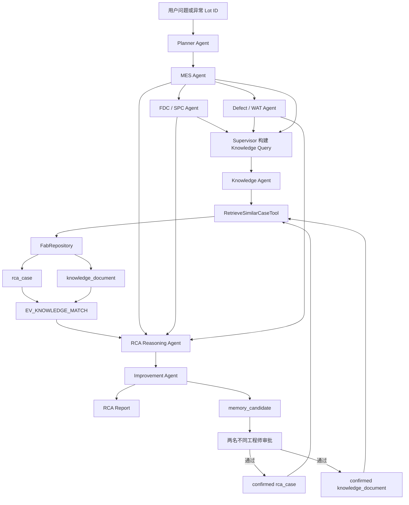
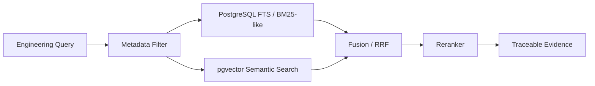

# Yield RCA Multi-Agent 系统 RAG 架构与代码讲解

> 文档状态：基于当前项目代码整理  
> 更新时间：2026-07-23  
> 适用范围：当前 MVP、Step 19 Memory Approval、Step 20 Advanced SPC

## 1. 文档目的

本文说明本项目中的 RAG 如何工作，包括：

- RAG 在 Yield RCA 系统中的定位；
- Knowledge Agent、Tool、Repository 和 PostgreSQL 的分层；
- 检索 Query 如何由当前 Fab 证据生成；
- 历史案例如何检索、评分和转换为可追溯 Evidence；
- LLM 在 RAG 链路中的作用和边界；
- RCA 完成后如何通过双工程师审批写回长期知识库；
- 当前实现与 pgvector/Embedding 目标架构之间的差距；
- 相关代码、Schema、API 和测试入口。

本文严格描述当前代码。尚未实现的向量检索、文档切块、Embedding 和
Reranker 不会被写成现有能力。

---

## 2. 先给出结论

当前项目已经实现 RAG 的完整工程接口和闭环，但检索算法仍处于 MVP 阶段。

当前实现是：

```text
结构化 Fab 证据
  -> 生成工程检索 Query
  -> 从已确认的历史 RCA Case 中进行 metadata + keyword 评分
  -> 读取最佳 Case 对应的 Knowledge Document
  -> 生成带 evidence_ids 的 Knowledge AgentFinding
  -> 参与 RCA evidence-based scoring
  -> 生成 Improvement 建议
  -> 双工程师审批
  -> 写回 confirmed RCA Case 和 Knowledge Document
```

当前没有实现：

```text
Embedding
Vector Index
pgvector / Chroma
Document Chunking
Semantic Top-K
Cross-Encoder Reranking
通用 PDF/SOP 摄取 Pipeline
```

因此，更准确的名称是：

> 基于已确认历史案例的可追溯检索增强 RCA，而不是通用向量问答系统。

---

## 3. RAG 在本项目中的定位

传统 RAG 通常是：

```text
用户问题 -> 文档检索 -> LLM 生成回答
```

本项目不是这个模式。本项目先由 MES、FDC、Defect/WAT Tool 得到当前 Fab
事实，再检索历史知识：

```text
当前 Fab 事实
  + 历史已确认 RCA
  -> RCA Evidence Fusion
```

历史案例不是最终结论的唯一来源，只是一类辅助证据。当前 RCA 权重为：

| 证据来源 | 权重 |
|---|---:|
| MES commonality | 30% |
| FDC / SPC signal | 30% |
| Defect / WAT consistency | 20% |
| Historical knowledge | 20% |

这意味着即使历史案例高度相似，也不能单独把一次 RCA 判定为 `supported`。
系统仍要求 MES、FDC、Defect/WAT 等当前批次证据通过确定性门槛。

相关代码：

- `core/yield_rca_core/rca_reasoning_agent.py`
- `_knowledge_strength()`
- `RCAReasoningAgent.analyze()`

---

## 4. 总体架构



该架构包含两个方向：

1. **读取方向**：历史知识增强当前 RCA。
2. **写回方向**：当前 RCA 经人工确认后成为未来知识。

---

## 5. 分层设计

### 5.1 Planner Layer

Planner 生成包含 Knowledge Task 的有向无环任务计划：

```text
MES
  -> FDC
  -> Defect/WAT
  -> Knowledge
  -> RCA Reasoning
  -> Improvement
```

Knowledge Task 必须依赖 MES、FDC 和 Defect/WAT，因为检索 Query 不是直接使用
用户原话，而是优先使用 Specialist 已经确认的结构化事实。

关键代码：

```python
task_knowledge = AgentTask(
    task_id="task_knowledge",
    agent=AgentKind.KNOWLEDGE.value,
    objective="Retrieve historical cases relevant to the collected engineering findings.",
    depends_on=[
        task_mes.task_id,
        task_fdc.task_id,
        task_defect_wat.task_id,
    ],
)
```

源文件：

- `core/yield_rca_core/planner_agent.py`

### 5.2 Supervisor Layer

Supervisor 负责：

- 读取 MES/FDC/Defect-WAT findings；
- 构建检索 Query；
- 调用 Knowledge Agent；
- 把 Knowledge finding 写入 `RCAState`；
- 调度 RCA Reasoning 和 Improvement。

源文件：

- `core/yield_rca_core/supervisor.py`
- `_knowledge_query()`
- `Supervisor._execute_task()`

### 5.3 Agent Layer

`KnowledgeAgent` 不访问数据库，只允许调用 `RetrieveSimilarCaseTool`。

它把 ToolOutput 转换为统一的 `AgentFinding`：

```text
finding
confidence
evidence_ids
details.top_case
details.cases
details.documents
warnings
```

源文件：

- `core/yield_rca_core/specialist_agents.py`
- `KnowledgeAgent`

### 5.4 Tool Layer

`RetrieveSimilarCaseTool` 封装实际检索能力。Agent 不知道 SQL、CSV 或表结构。

源文件：

- `core/yield_rca_core/tool_layer.py`
- `RetrieveSimilarCaseTool`

### 5.5 Repository Layer

Tool 通过统一 `FabRepository` 接口读取数据：

```python
class FabRepository(Protocol):
    def rows(self, table_name: str) -> list[Row]:
        ...
```

当前有两个实现：

| 实现 | 用途 |
|---|---|
| `CsvFabRepository` | 离线 seed、测试、纯 Python workflow |
| `PostgresFabRepository` | Docker/FastAPI 运行时 |

源文件：

- `core/yield_rca_core/repositories.py`

---

## 6. Knowledge Query 如何生成

Knowledge Query 由 Supervisor 的 `_knowledge_query()` 生成。

输入来源：

| 来源 | Query 内容 |
|---|---|
| MES | module、equipment |
| FDC | parameter names |
| Defect | defect types |
| WAT | fail modes |
| Metrology | metric names |
| Recipe | Recipe ID、Version、recipe change |

例如 `LOT_A_015` 的当前证据可能形成近似 Query：

```text
Cu CMP endpoint time estimated removal rate head pressure
motor current platen speed post cmp thickness slurry flow
cu residue leakage short
```

同时还会传入结构化过滤字段：

```json
{
  "module": "Cu CMP",
  "equipment_type": "CMP"
}
```

如果 Specialist 没有形成足够内容，才回退到用户原始问题。

该设计的优点是：

- 用户不需要准确说出设备参数名；
- Query 建立在 Tool 事实之上；
- 历史检索发生在当前问题上下文已经明确之后；
- 可避免只凭自然语言问题检索到不相关 Module。

当前限制：

- Query 仍是简单字符串拼接；
- 没有同义词、工艺术语词典和 Query Expansion；
- 中文自然语言的空格分词效果有限；
- 没有 LLM 生成自由检索词，目的是先控制检索边界。

---

## 7. 当前检索算法

### 7.1 Confirmed Gate

检索首先过滤未确认案例：

```python
if case.get("validation_status", "CONFIRMED").upper() != "CONFIRMED":
    continue
```

只有 `CONFIRMED` 的案例可以成为 Knowledge Evidence。

如果没有确认案例，Tool 返回：

```text
EV_KNOWLEDGE_NO_CONFIRMED_MATCH
WARN_KNOWLEDGE_NO_CONFIRMED_CASE
```

Draft Memory Candidate 不会被 Knowledge Agent 检索。

### 7.2 Searchable Text

每个 Case 的以下字段被拼接为可检索文本：

```text
title
module
equipment_type
symptom
root_cause
solution
```

当前 `knowledge_document.content` 不参与第一阶段 Case 评分，只在选出最佳 Case
后作为补充上下文返回。

### 7.3 Keyword Score

当前评分逻辑为：

```python
score = 0.0

for token in query_tokens:
    if token in searchable:
        score += 0.08

if module matches:
    score += 0.25

if equipment_type exact matches:
    score += 0.20

score = min(
    0.99,
    max(score, case_confidence * 0.8),
)
```

然后按 `similarity` 降序排序。

### 7.4 最佳案例和文档

Tool 选择排序第一的 `best_case`，再读取：

```text
knowledge_document.case_id == best_case.case_id
validation_status == CONFIRMED
```

最终返回：

```json
{
  "query": "...",
  "cases": ["所有已确认案例及其评分"],
  "top_case": {"最佳案例"},
  "documents": ["最佳案例关联文档"]
}
```

### 7.5 当前算法的真实含义

这里的 `similarity` 是工程启发式分数，不是：

- cosine similarity；
- embedding similarity；
- 概率；
- 经过校准的置信度。

名称沿用了未来向量检索接口，但当前只能解释为“检索匹配分数”。

---

## 8. Evidence 如何生成和追溯

找到最佳案例后，Tool 创建：

```text
Evidence ID: EV_KNOWLEDGE_MATCH
Source Type: knowledge
Source Table: rca_case
Source ID: case_id
Timestamp: case.created_at
Metadata:
  root_cause
  validation_status
  linked documents
```

示例：

```json
{
  "evidence_id": "EV_KNOWLEDGE_MATCH",
  "source_type": "knowledge",
  "source_id": "RCA_MULTI_CU_001",
  "source_table": "rca_case",
  "summary": "Historical RCA case RCA_MULTI_CU_001 matches query...",
  "metadata": {
    "validation_status": "CONFIRMED",
    "documents": []
  }
}
```

`KnowledgeAgent` 必须把 Tool 返回的 `evidence_ids` 原样写入 `AgentFinding`。

这条 Evidence 会继续进入：

- `RCAState.evidence`；
- Evidence Chain；
- RCA hypothesis；
- recommended actions；
- Improvement finding；
- Markdown Report；
- Memory Candidate；
- 审批后发布的 Knowledge Document。

---

## 9. Knowledge Agent 行为

### 9.1 有匹配案例

输出：

```text
summary:
  Historical case <case_id> matched at <similarity>;
  documented root cause: <root_cause>.

confidence:
  similarity

evidence_ids:
  EV_KNOWLEDGE_MATCH
```

如果最佳匹配低于 `0.75`，追加：

```text
WARN_KNOWLEDGE_WEAK_MATCH
```

### 9.2 没有确认案例

输出一个合法但置信度为 0 的 AgentFinding：

```text
confidence = 0.0
top_case = {}
cases = []
documents = []
```

系统不会因为知识库为空而中断 RCA。

### 9.3 LLM 模式

Knowledge Tool 的检索和评分仍然是确定性的。Qwen 不直接访问数据库，也不自由
改写检索结果。

在 `llm` 模式下，Supervisor 会把确定性 Knowledge Finding 交给 Specialist
Review Prompt。LLM 只允许：

- 改写 summary；
- 给出 engineering interpretation；
- 在原始 Evidence 范围内表达。

LLM 必须保留完全相同的 `evidence_ids`：

```python
if set(llm_evidence_ids) != set(tool_finding.evidence_ids):
    raise LLMOutputValidationError(...)
```

Prompt：

- `core/yield_rca_core/prompts/specialist_v1.md`

---

## 10. RAG 如何影响 RCA Reasoning

### 10.1 Knowledge Strength

RCA Reasoning 读取最佳案例的 `similarity`：

```python
knowledge_strength = top_case.similarity
```

它在总评分中占 20%：

```text
knowledge contribution = similarity * 0.20
```

### 10.2 Historical Candidates

历史案例也会进入 Top-3 Candidate Catalog：

```python
historical_candidate_score = similarity * 0.20
```

当前 MES/FDC 形成的候选使用完整 evidence score，因此正常情况下当前 Fab 证据
应排在历史相似案例之前。

### 10.3 Recommended Actions

当 RCA 被确定性门控判定为 `supported` 后，可以读取最佳历史 Case 的
`solution` 作为 corrective actions，并引用：

```text
EV_KNOWLEDGE_MATCH
```

如果 RCA 为 `inconclusive`，历史 Case 即使高度相似，也不会直接输出具体修复动作。

### 10.4 LLM 不能覆盖最终门控

在 LLM 模式下，Qwen 只能在确定性生成的 Candidate Catalog 中排序：

```text
不能创建新 root cause
不能引用未知 evidence_id
不能把历史案例字段改成新的结论
```

最终 `supported/inconclusive` 和 confidence 仍由确定性代码计算。

Prompt：


---

## 11. Knowledge 数据模型

### 11.1 rca_case

用途：保存结构化历史 RCA。

主要字段：

| 字段 | 含义 |
|---|---|
| `case_id` | Case 主键 |
| `title` | 标题 |
| `technology` | 技术节点 |
| `module` | 工艺 Module |
| `equipment_type` | 设备类型 |
| `symptom` | 异常现象 |
| `root_cause` | 已确认根因 |
| `solution` | 已确认处理方案 |
| `confidence` | Case 自身置信度 |
| `validation_status` | 当前仅允许 `CONFIRMED` |
| `source_candidate_id` | 来源 Memory Candidate |
| `approval_count` | 审批数 |
| `approved_at` | 确认时间 |

### 11.2 knowledge_document

用途：保存 Case 关联的文本知识。

主要字段：

| 字段 | 含义 |
|---|---|
| `document_id` | 文档主键 |
| `case_id` | 关联 RCA Case |
| `document_type` | `RCA_CASE` / `SOP` / `ENGINEERING_NOTE` |
| `title` | 文档标题 |
| `content` | 文本或结构化 JSON 文本 |
| `tags` | PostgreSQL text array |
| `validation_status` | 当前仅允许 `CONFIRMED` |

当前建立了：

```text
rca_case(module, equipment_type) index
knowledge_document(case_id) index
knowledge_document.tags GIN index
```

注意：当前检索代码尚未使用 tags GIN，也没有使用 PostgreSQL Full Text Search。

Schema：

- `db/migrations/001_initial_schema.up.sql`
- `db/migrations/003_memory_approval.up.sql`

---

## 12. 当前 Seed 知识示例

`spc_case` 包含三个历史案例：

| Case | Module | 根因 |
|---|---|---|
| `RCA_MULTI_CU_001` | Cu CMP | Slurry delivery degradation |
| `RCA_MULTI_SCRATCH_001` | Cu CMP | Transient particle/handling，未确认精确来源 |
| `RCA_MULTI_ILD_001` | Thin Film | ILD deposition chamber rate excursion |

数据文件：

- `data/seeds/spc_case/rca_case.csv`
- `data/seeds/spc_case/knowledge_document.csv`

`LOT_A_015` 检索时应优先命中：

```text
RCA_MULTI_CU_001
```

其历史知识包括：

```text
slurry flow decline
removal-rate loss
endpoint extension
Cu residue
leakage short
```

---

## 13. Memory 写回闭环

RAG 的长期价值不只是读取，还包括受控写回。

### 13.1 Candidate 创建条件

只有满足以下条件才创建 `memory_candidate`：

```text
RCA hypothesis.status == supported
恰好存在一个 Improvement finding
Improvement 包含结构化 recommendations
```

`inconclusive` RCA 不能成为可发布知识。

### 13.2 审批规则

- Event-level 和 Fab-level 都需要两名工程师审批；
- 两个 `engineer_id` 必须不同；
- 同一工程师不能重复提交；
- 任意一次 reject 会终止 Candidate；
- 如果包含 Recipe Optimization，至少一名审批人必须是
  `process_engineer`；
- 审批只发布知识，不直接修改生产 Recipe。

### 13.3 发布事务

第二次有效审批后，`PostgresMemoryStore.commit_decision()` 在同一数据库事务中：

```text
1. 锁定 memory_candidate
2. 插入 memory_approval
3. 插入 confirmed rca_case
4. 插入 confirmed knowledge_document
5. 更新 memory_candidate 为 published
```

发布后的 Case 会在后续 RCA 中被 `RetrieveSimilarCaseTool` 检索。

### 13.4 发布内容

发布的 `knowledge_document.content` 包含：

```json
{
  "engineering_summary": "...",
  "recommendations": {},
  "evidence_ids": [],
  "approvals": []
}
```

这使新知识保留：

- 工程总结；
- 改进建议；
- 原始 Evidence 引用；
- 审批记录。

核心代码：

- `backend/yield_rca_api/memory.py`
- `build_memory_candidate()`
- `MemoryApprovalService`
- `PostgresMemoryStore.commit_decision()`

---

## 14. Memory API

```text
GET  /rca/jobs/{job_id}/memory-candidate
GET  /memory/candidates/{candidate_id}
POST /memory/candidates/{candidate_id}/approvals
```

审批请求：

```json
{
  "engineer_id": "PE001",
  "engineer_role": "process_engineer",
  "decision": "approve",
  "comment": "Evidence and Recipe DOE gate reviewed."
}
```

当前身份边界：

- API 接收结构化 `engineer_id` 和 role；
- 还没有企业 SSO、JWT、RBAC 或可信角色映射；
- 因此当前是功能性双人审批，不是生产级安全审批。

---

## 15. LLM 在整个 RAG 链路中的边界

当前 Qwen `qwen-plus` 参与以下位置：

| 阶段 | LLM 可以做什么 | LLM 不能做什么 |
|---|---|---|
| Planner | 在注册 Agent 内调整 TaskPlan | 查询数据库、生成 RCA |
| Specialist Review | 解释 Tool Finding | 改变 evidence_ids、发明数据 |
| RCA Reasoning | 在 Candidate Catalog 内排序 | 创造新根因、越过确定性门控 |
| Improvement | 改写工程总结 | 增加未知动作或 Fab 级结论 |

RAG 检索本身当前不调用 LLM：

```text
Query 构建：确定性
Case 过滤：确定性
Case 评分：确定性
Evidence 创建：确定性
```

这种设计把 LLM 用在解释和有限推理上，把数据检索和最终门控保留为可测试代码。

---

## 16. 当前实现的优点

### 16.1 可追溯

历史结论通过 `EV_KNOWLEDGE_MATCH` 进入 Evidence Chain，报告可以定位到具体
`rca_case.case_id`。

### 16.2 Agent 不直接访问数据库

Knowledge Agent 只依赖 Tool，符合系统统一边界。

### 16.3 历史知识不会压过当前事实

Knowledge 只占 20%，当前 MES/FDC/Defect-WAT 才是核心证据。

### 16.4 未确认知识不可检索

检索层强制 `validation_status == CONFIRMED`。

### 16.5 人工审批形成闭环

新 RCA 不会被 Agent 自动写入高权重知识库，避免知识污染。

### 16.6 CSV 和 PostgreSQL 行为一致

纯 Python 测试与 Docker/FastAPI 使用相同 Tool 和 Agent 逻辑。

---

## 17. 当前实现的局限和风险

### 17.1 不是语义检索

同义表达无法稳定命中。例如：

```text
slurry starvation
chemical delivery instability
slurry flow degradation
```

当前算法可能把它们视为不同字符串。

### 17.2 文档正文不参与初始排序

`knowledge_document.content` 只在最佳 Case 选出后加载。SOP 和 Engineering Note
不能独立召回。

### 17.3 Keyword 是 substring match

当前没有：

- 分词；
- 词干；
- 同义词；
- BM25；
- 字段权重配置；
- 停用词。

### 17.4 Case Confidence 形成评分下限

当前：

```text
score >= case.confidence * 0.8
```

高置信历史 Case 即使关键词匹配较弱，也可能得到不低的分数。虽然 RCA 中只有
20% 权重，但检索排序仍可能受影响。

### 17.5 没有真正的 Metadata Filter

Module 和 equipment type 当前主要是加分，不是严格 SQL WHERE 过滤。不同 Module
Case 仍会进入候选列表。

### 17.6 没有 Top-K 和最低召回阈值

Tool 返回所有已确认 Case，只对最佳 Case 小于 `0.75` 发出 warning。

### 17.7 Tags 索引尚未使用

Schema 有 tags GIN index，但 Tool 目前把数据全部读入 Python 后评分。

### 17.8 生产权限未实现

双工程师审批规则已经实现，但 API 身份仍来自请求体。

### 17.9 Evidence 生命周期

发布文档保存的是 `evidence_ids`，尚未把完整 Evidence Snapshot 独立归档。真实
Fab 数据存在保留期限时，需要解决历史 Evidence 长期可复核问题。

---

## 18. 推荐演进路线

### Phase A：先强化当前非向量检索

建议先完成：

```text
严格 metadata filter
PostgreSQL full-text search
字段权重
Top-K
最低阈值
术语归一化
中英文 Fab 词典
检索评估集
```

推荐输出统一 Retriever 接口：

```python
retrieve(query, filters, top_k) -> list[RetrievedKnowledge]
```

### Phase B：引入 pgvector Hybrid Retrieval

建议优先使用现有 PostgreSQL 的 `pgvector`，避免增加独立向量数据库。

目标数据模型：

```text
knowledge_document
  -> knowledge_chunk
       chunk_id
       document_id
       content
       metadata
       embedding
       embedding_model
       content_hash
       version
```

检索流程：



### Phase C：受控文档摄取

增加离线 Knowledge Ingestion：

```text
RCA Report / SOP / Engineering Note
  -> Parser
  -> Chunker
  -> Metadata Validation
  -> Embedding
  -> Human Validation
  -> Publish
```

要求保存：

- 文档版本；
- 来源系统；
- 生效时间；
- Module/Equipment/Recipe metadata；
- 权限标签；
- 内容 hash；
- Embedding model/version；
- 审批状态。

### Phase D：Reranking 和评估

建议建立半导体场景评估指标：

```text
Recall@K
MRR
nDCG@K
Confirmed-case precision
Cross-module false match rate
Evidence citation accuracy
Historical-case overreliance rate
Retrieval latency
```

---

## 19. 代码导航

| 功能 | 文件 |
|---|---|
| Workflow 组装 | `core/yield_rca_core/workflow.py` |
| Planner Knowledge Task | `core/yield_rca_core/planner_agent.py` |
| Knowledge Query 构建 | `core/yield_rca_core/supervisor.py` |
| Knowledge Agent | `core/yield_rca_core/specialist_agents.py` |
| Historical Case Tool | `core/yield_rca_core/tool_layer.py` |
| CSV/Postgres Repository | `core/yield_rca_core/repositories.py` |
| RCA Knowledge 权重 | `core/yield_rca_core/rca_reasoning_agent.py` |
| Improvement 使用历史知识 | `core/yield_rca_core/improvement_agent.py` |
| Memory Domain Model | `core/yield_rca_core/memory_models.py` |
| Memory Approval/Publication | `backend/yield_rca_api/memory.py` |
| Memory API | `backend/yield_rca_api/app.py` |
| Knowledge Schema | `db/migrations/001_initial_schema.up.sql` |
| Approval Schema | `db/migrations/003_memory_approval.up.sql` |
| LLM Prompts | `core/yield_rca_core/prompts/` |
| Seed Cases | `data/seeds/spc_case/rca_case.csv` |
| Seed Documents | `data/seeds/spc_case/knowledge_document.csv` |

---

## 20. 相关测试

### 20.1 Tool 检索测试

文件：

- `tests/contract/test_tool_layer_contracts.py`

覆盖：

- 正确命中历史 Cu CMP Case；
- 返回 `EV_KNOWLEDGE_MATCH`；
- 返回关联 Knowledge Document；
- 排除 `validation_status=DRAFT` 的案例；
- 输出可序列化和可追溯。

### 20.2 Knowledge Agent 测试

文件：

- `tests/contract/test_specialist_agents_contracts.py`

覆盖：

- ToolOutput 转换为 AgentFinding；
- similarity 转换为 confidence；
- evidence_ids 完整保留；
- Agent 不依赖 Repository/SQL。

### 20.3 RCA 融合测试

文件：

- `tests/contract/test_rca_reasoning_agent_contracts.py`
- `tests/integration/test_multi_case_workflow.py`
- `tests/integration/test_spc_workflow.py`

覆盖：

- 当前证据和历史知识融合；
- Top-3 Candidate 可追溯；
- 历史知识不能单独支持 RCA；
- `LOT_A_015` 最终得到 supported slurry RCA；
- 冲突/缺失证据保持 inconclusive。

### 20.4 Memory Approval 测试

文件：

- `tests/contract/test_memory_approval_contracts.py`
- `tests/integration/test_fastapi_backend.py`
- `tests/contract/test_memory_schema_contracts.py`

覆盖：

- 需要两名不同工程师；
- Recipe 建议需要 Process Engineer；
- reject 为终止状态；
- inconclusive 不可发布；
- 发布 Case 为 `CONFIRMED`；
- API 创建和审批 Candidate。

建议命令：

```powershell
.\.venv\Scripts\python.exe -m pytest `
  tests\contract\test_tool_layer_contracts.py `
  tests\contract\test_specialist_agents_contracts.py `
  tests\contract\test_rca_reasoning_agent_contracts.py `
  tests\contract\test_memory_approval_contracts.py `
  tests\integration\test_multi_case_workflow.py `
  tests\integration\test_spc_workflow.py `
  tests\integration\test_fastapi_backend.py -q
```

---

## 21. 一次 LOT_A_015 的完整 RAG 示例

### Step 1：输入

```text
Lot-driven RCA
LOT_A_015
```

### Step 2：当前 Fab Evidence

```text
MES:
  CMP_CU03_CH02 commonality
  Trigger Hold + Impact Holds

FDC/SPC:
  slurry_flow decline
  estimated_removal_rate decline
  endpoint_time increase
  Nelson rule violations

Defect/WAT:
  Cu residue
  leakage short
```

### Step 3：Knowledge Query

```text
Cu CMP slurry flow estimated removal rate endpoint time
cu residue leakage short
```

### Step 4：历史召回

```text
Top Case:
  RCA_MULTI_CU_001

Evidence:
  EV_KNOWLEDGE_MATCH
```

### Step 5：RCA Fusion

```text
Root Cause:
  CMP_CU03_CH02 slurry delivery degradation

Status:
  supported
```

### Step 6：Improvement

```text
Containment
Corrective Action
Recipe Optimization
Preventive Action
Fab/System Optimization
```

### Step 7：Memory Candidate

```text
pending_approval
```

### Step 8：双工程师确认

```text
Yield Engineer approve
Process Engineer approve
```

### Step 9：知识回写

```text
confirmed rca_case
confirmed knowledge_document
```

下一次类似异常就可以检索到这条经过工程师确认的新知识。

---

## 22. 总结

当前项目的 RAG 已经完成了最重要的工业系统边界：

1. 从当前 Fab Evidence 构建检索上下文；
2. Agent 通过 Tool 检索，不直接访问数据库；
3. 历史 Case 转换为可追溯 Evidence；
4. 历史知识只辅助 RCA，不覆盖当前事实；
5. LLM 只能在已知 Evidence 和 Candidate 范围内工作；
6. 新知识必须经过双工程师审批；
7. 只有 confirmed Case 才能成为未来高权重证据。

当前最主要的技术缺口不是 Agent 接口，而是 Retriever 能力。下一阶段应在保留
现有 Evidence、Approval 和 deterministic gate 的前提下，把
`RetrieveSimilarCaseTool` 内部从启发式关键词评分升级为：

```text
Metadata Filter
+ PostgreSQL Full Text Search
+ pgvector Semantic Search
+ Reranking
+ Retrieval Evaluation
```

这样可以增强召回能力，同时不破坏已经建立的工业可追溯和人工确认闭环。
